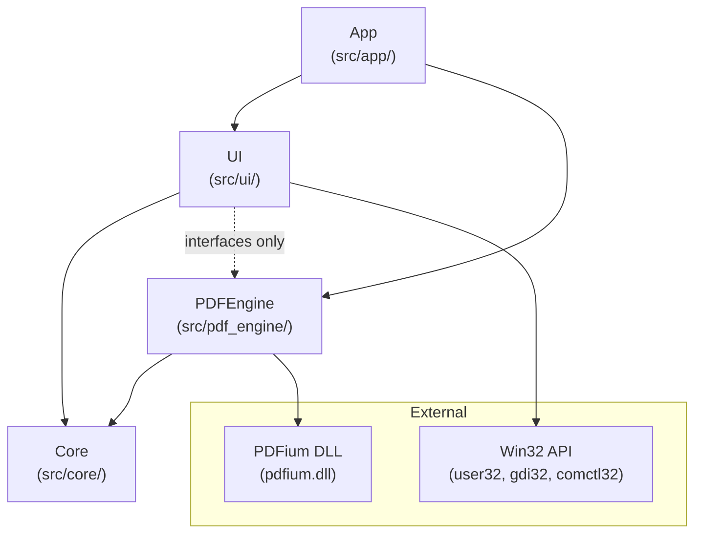
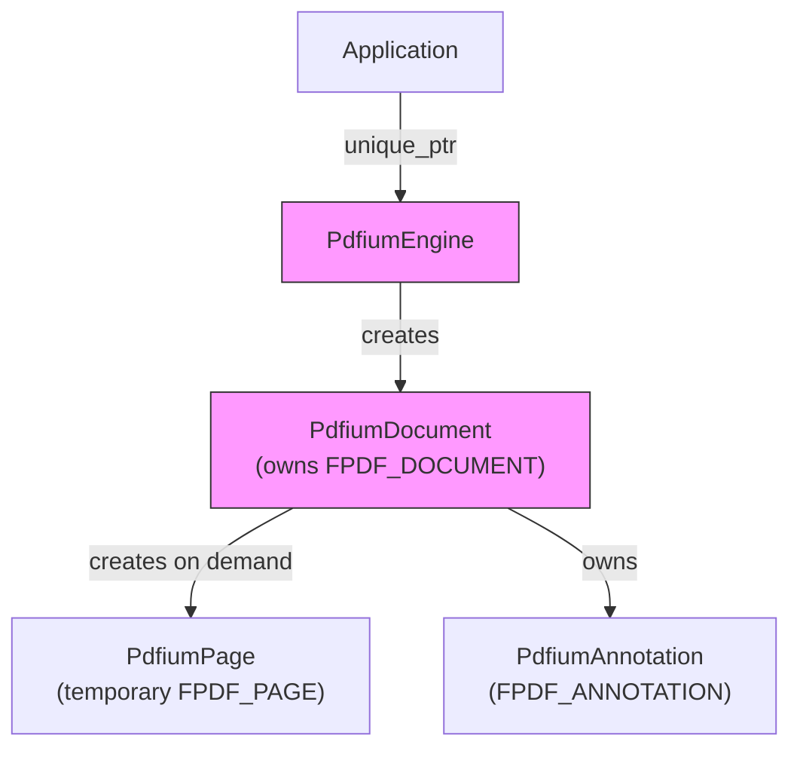
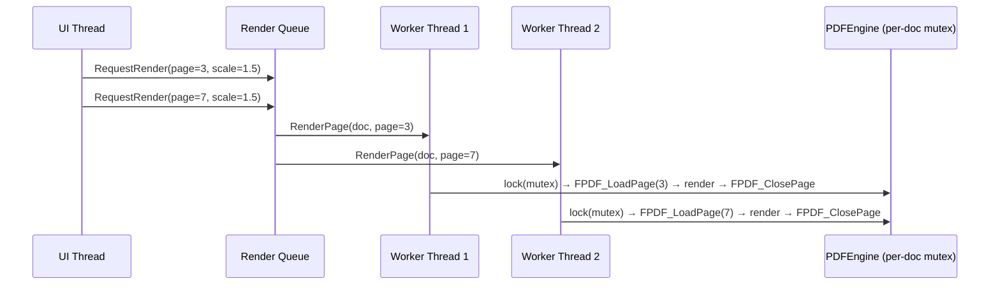
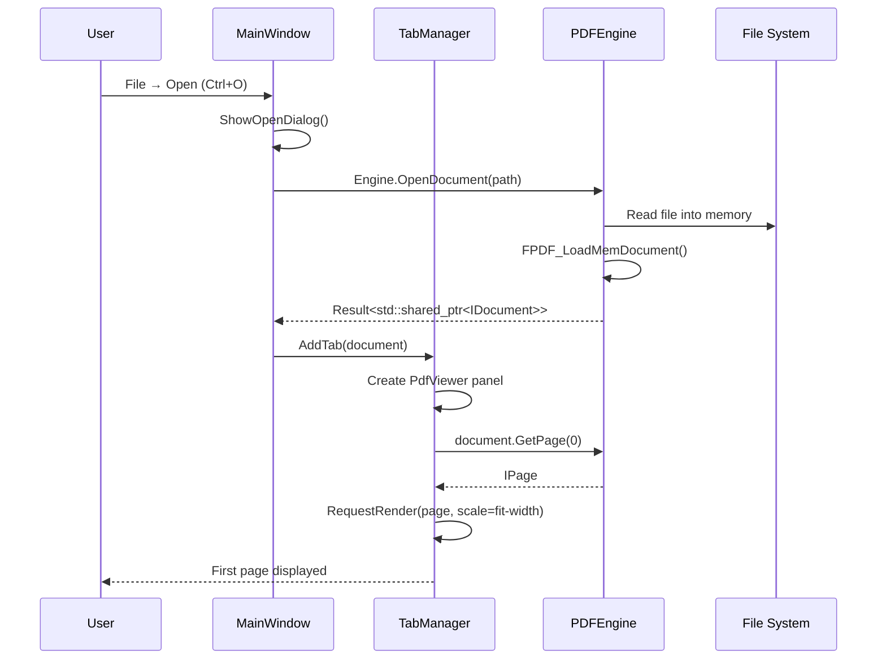
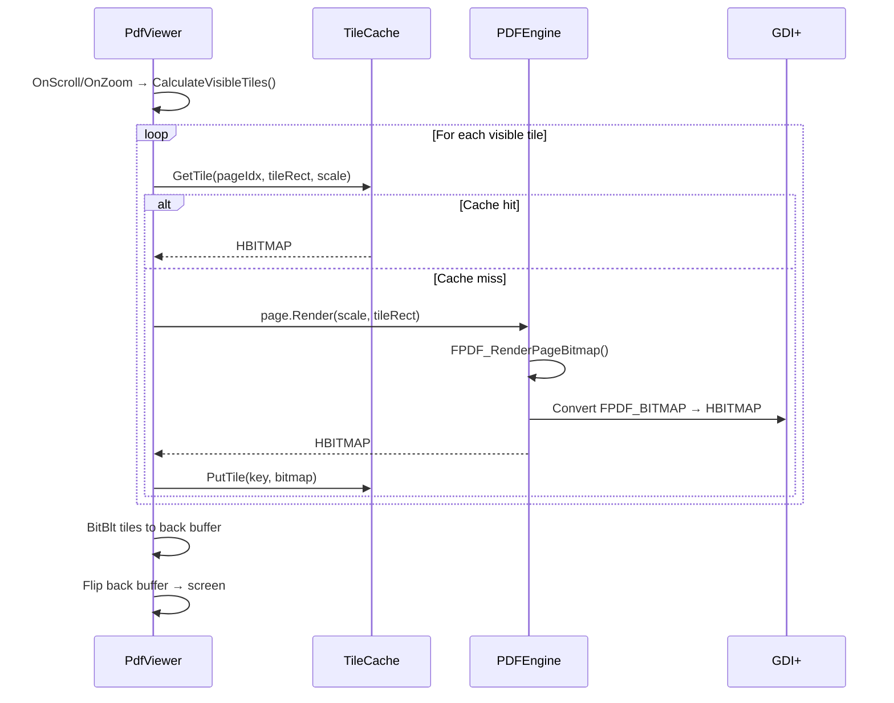
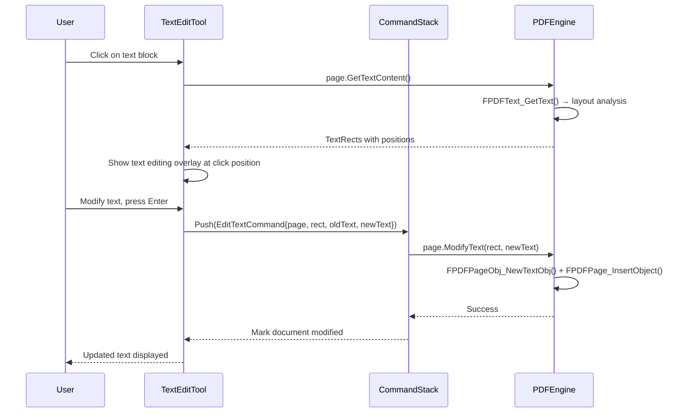
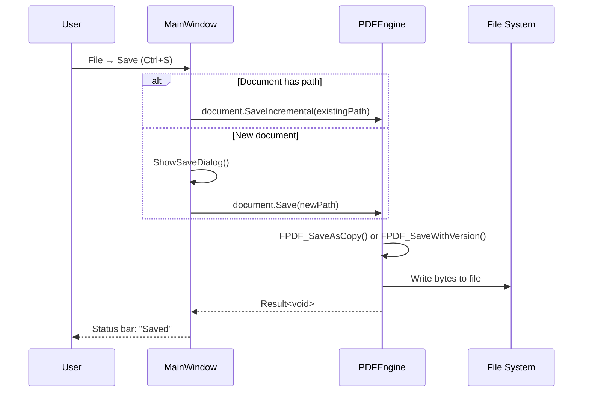

# ARCHITECTURE.md — PDF Elite Native Application Architecture

> **Version:** 1.0 | **Status:** Draft | **Target:** C++20 / Win32 / PDFium / CMake / MSVC

---

## 1. Overview

PDF Elite Native replaces the current Tauri+Rust+React+Java/Spring Boot stack (FACT: v2.14.2, Stirling PDF fork) with a single native Windows executable. The goal is to eliminate the ~200MB JRE bundle, the Rust↔Java IPC bridge, and the Electron-style web UI while preserving the 17 core tools.

### Design Principles

| Principle | Description |
|---|---|
| **Single binary** | One `.exe` + PDFium DLL. No JRE, no Node, no Rust runtime. |
| **Local-first** | All processing on-device. No network calls. No SaaS. |
| **Fast** | Native rendering via PDFium, no WASM bridge, no IPC serialization. |
| **Private** | No telemetry, no cloud features, no analytics. |
| **Simple** | ~17 tools, not 60+. No plugin system. No dependency injection framework. |

---

## 2. Module Hierarchy



### Dependency Rule

Dependencies flow strictly downward. No upward or circular dependencies.

```
App → UI → PDFEngine → Core
  ↑                    ↑
  └── wiring only ─────┘

UI depends on PDFEngine's PUBLIC INTERFACES only (IDocument.h, IPage.h, etc.)
UI must NEVER include PDFEngine implementation headers (PdfiumDocument.h, etc.)
```

---

## 3. Module Details

### 3.1 Core (`src/core/`)

**Purpose:** Foundational types, utilities, and interfaces shared by all modules.

| Component | File | Description |
|---|---|---|
| Result type | `Result.h` | `template<typename T> using Result = std::expected<T, ErrorCode>;` |
| Error codes | `ErrorCode.h` | Enum of all application error codes |
| Logging | `Logger.h/.cpp` | Simple logging to file/console |
| String utils | `StringUtils.h` | `Utf8ToWide()`, `WideToUtf8()`, path helpers |
| Math types | `Rect.h`, `Point.h`, `Size.h` | `RectF`, `PointF`, `SizeF` — used by both UI and PDFEngine |
| Events | `Event.h` | `template<typename... Args> class Event;` — observer/callback |
| Command | `ICommand.h` | Interface for undoable operations |
| Command Stack | `CommandStack.h` | Manages undo/redo history |
| Interface defs | `IDocument.h`, `IPage.h`, `IAnnotation.h`, `ITextContent.h` | Abstract interfaces |
| Constants | `Constants.h` | `kDefaultTileSize`, `kMaxZoom`, version strings |

**CMake target:** `pdf_elite_core` (STATIC library)

### 3.2 PDFEngine (`src/pdf_engine/`)

**Purpose:** All PDF operations via PDFium. This is the ONLY module that touches FPDF_* APIs.

| Component | File | Description |
|---|---|---|
| Document | `PdfiumDocument.h/.cpp` | Implements `IDocument`. Owns `FPDF_DOCUMENT`. RAII wrapper. |
| Page | `PdfiumPage.h/.cpp` | Implements `IPage`. Loads/renders `FPDF_PAGE`. Tile generation. |
| Annotation | `PdfiumAnnotation.h/.cpp` | Implements `IAnnotation`. Wraps `FPDF_ANNOTATION`. |
| Text | `PdfiumTextContent.h/.cpp` | Implements `ITextContent`. `FPDFTEXT_*` wrappers. |
| Engine | `PdfiumEngine.h/.cpp` | Factory: initializes PDFium, creates `PdfiumDocument` instances. |
| Render cache | `TileCache.h/.cpp` | LRU cache of rendered tiles (bitmap pool). |
| Text editor | `PdfTextEditor.h/.cpp` | PDF text extraction → modification → re-embedding via FPDF_EDIT. |
| Page manager | `PageManager.h/.cpp` | Insert, delete, rotate, reorder, split, merge pages. |
| Image manager | `ImageManager.h/.cpp` | Add, extract, remove, replace images in PDF pages. |
| Form filler | `FormHandler.h/.cpp` | AcroForm interaction (FUTURE). |

**FACT:** In the current app, PDF rendering uses EmbedPDF (commercial) with Pdfium WASM engine + 20 plugins, and pdfjs-dist 5.4.149 for thumbnails/metadata. The native app replaces both with direct PDFium C API calls.

**CMake targets:**
- `pdf_engine_interfaces` (INTERFACE library — headers only, linked by UI)
- `pdf_engine_impl` (STATIC library — implementation, linked by App only)

### 3.3 UI (`src/ui/`)

**Purpose:** Win32 windows, controls, rendering surfaces, and user interaction.

| Component | File | Description |
|---|---|---|
| Main window | `MainWindow.h/.cpp` | Top-level frame: menu bar, toolbar, status bar, tab bar. |
| Tab manager | `TabManager.h/.cpp` | MDI-like tabs for multiple open documents. |
| Viewer | `PdfViewer.h/.cpp` | Scrollable viewport with tile rendering, zoom, pan. |
| Thumbnail panel | `ThumbnailPanel.h/.cpp` | Page thumbnail sidebar. |
| Toolbar | `Toolbar.h/.cpp` | Tool selection, zoom controls, undo/redo. |
| Properties panel | `PropertiesPanel.h/.cpp` | Document properties, page properties. |
| Dialogs | `dialogs/*.h/.cpp` | Open, Save, Print, Settings, About, Page number format. |
| Tool panels | `tools/*.h/.cpp` | Per-tool UI panels (text editor, annotation tools, etc.). |
| Command system | `Command.h/.cpp` | Command pattern for undo/redo. |
| Resource loader | `Resources.h/.cpp` | String tables, icons, accelerators from .rc file. |
| Theme | `Theme.h/.cpp` | Dark/light theme via Win32 manifests + custom drawing. |

**CMake target:** `pdf_elite_ui` (STATIC library)

### 3.4 App (`src/app/`)

**Purpose:** Entry point, wiring, application lifecycle.

| Component | File | Description |
|---|---|---|
| Entry point | `main.cpp` | `WinMain()`, message loop, COM init. |
| Application | `Application.h/.cpp` | Creates main window, initializes PDFEngine, routes commands. |
| CommandLine | `CommandLine.h/.cpp` | Parses command-line arguments (file to open, etc.). |

**CMake target:** `pdf_elite` (EXECUTABLE)

---

## 4. PDFium Abstraction Layer

### 4.1 Interface Definitions

```cpp
// IDocument.h — defined in Core, implemented in PDFEngine
class IDocument {
public:
    virtual ~IDocument() = default;

    virtual Result<int> PageCount() const = 0;
    virtual Result<std::shared_ptr<IPage>> GetPage(int index) = 0;
    virtual Result<void> Save(const std::filesystem::path& path) = 0;
    virtual Result<void> SaveIncremental(const std::filesystem::path& path) = 0;
    virtual Result<DocumentMetadata> GetMetadata() const = 0;
    virtual bool IsModified() const = 0;
};

class IPage {
public:
    virtual ~IPage() = default;

    virtual Result<SizeF> PageSize() const = 0;
    virtual Result<void> SetRotation(int degrees) = 0;
    virtual Result<int> GetRotation() const = 0;
    virtual Result<std::vector<RectF>> Render(
        float scale, const RectF& clipRect) const = 0;
    virtual Result<std::shared_ptr<IAnnotation>> GetAnnotation(int index) = 0;
    virtual Result<int> AnnotationCount() const = 0;
    virtual Result<std::shared_ptr<ITextContent>> GetTextContent() = 0;
    virtual Result<void> Delete() = 0;  // Remove page from document
};

class IAnnotation {
public:
    virtual ~IAnnotation() = default;

    virtual AnnotationType GetType() const = 0;
    virtual Result<RectF> GetBounds() const = 0;
    virtual Result<std::string> GetContents() const = 0;
    virtual Result<void> SetContents(const std::string& text) = 0;
    virtual Result<void> SetColor(float r, float g, float b) = 0;
    virtual Result<void> Delete() = 0;
};

class ITextContent {
    virtual ~ITextContent() = default;
    virtual Result<std::string> ExtractAll() = 0;
    virtual Result<std::vector<TextRect>> GetTextRects() = 0;
    virtual Result<std::vector<TextSearchResult>> Search(const std::string& query) = 0;
};
```

### 4.2 RAII Ownership Model



- `PdfiumEngine` is a singleton that calls `FPDF_InitLibrary()` / `FPDF_DestroyLibrary()`.
- `PdfiumDocument` wraps `FPDF_DOCUMENT` with a custom deleter calling `FPDF_CloseDocument()`.
- `PdfiumPage` is **ephemeral**: created via `FPDF_LoadPage()`, destroyed after render. NOT cached across calls (PDFium pages are lightweight to load).
- `PdfiumAnnotation` lifetime is tied to its parent `PdfiumDocument`. Accessing after document close is UB.

### 4.3 Thread Safety Model



- **FACT:** PDFium allows concurrent access to different pages of the same document if each thread uses its own `FPDF_PAGE` handle. However, document-level operations (save, page insert/delete) require exclusive access.
- **RECOMMENDATION:** Use a per-document read-write lock. Rendering acquires shared (reader) lock. Mutations acquire exclusive (writer) lock.

---

## 5. Data Flow Diagrams

### 5.1 Open Document



### 5.2 Render Page (Tile-Based)



**FACT:** Current app uses 768px tiles with 5px overlap and 1 extra ring of pre-fetch tiles. Native app should replicate this strategy.

### 5.3 Edit Text



### 5.4 Save Document



---

## 6. UI Architecture

### 6.1 Window Hierarchy

```
MainWindow (WS_OVERLAPPEDWINDOW)
├── MenuBar (Win32 menu resource)
├── Toolbar (rebar + toolbar controls)
├── Client Area
│   ├── TabBar (custom-drawn or common controls tab control)
│   ├── Left Panel (sidebar)
│   │   ├── ThumbnailPanel
│   │   ├── OutlinePanel (bookmarks) — FUTURE
│   │   └── LayersPanel — FUTURE
│   ├── Center (PdfViewer — main rendering surface)
│   └── Right Panel (context-sensitive)
│       ├── PropertiesPanel
│       ├── TextEditPanel
│       └── AnnotationPropertiesPanel
└── StatusBar (status bar common control)
```

### 6.2 Command System (Undo/Redo)

```cpp
class ICommand {
public:
    virtual ~ICommand() = default;
    virtual Result<void> Execute() = 0;
    virtual Result<void> Undo() = 0;
    virtual std::string Description() const = 0;
};

class CommandStack {
public:
    void Push(std::unique_ptr<ICommand> cmd);
    Result<void> Undo();
    Result<void> Redo();
    bool CanUndo() const;
    bool CanRedo() const;
    void Clear();
};
```

**FACT:** Current app uses `useToolOperation` hook pattern in React. The native equivalent is the `CommandStack` + per-tool command classes.

### 6.3 Theme System

**FACT:** Current app uses dark theme via CSS variables + Mantine + `design-tokens.css`.
**RECOMMENDATION:** Native app uses Win32 dark mode (Windows 10 1809+ via `SetPreferredAppMode`) with a `Theme` class that provides colors for custom-drawn elements:

| Element | Dark | Light |
|---|---|---|
| Background | `#1a1a2e` | `#ffffff` |
| Surface | `#16213e` | `#f5f5f5` |
| Primary | `#0f3460` | `#1976d2` |
| Accent | `#e94560` | `#e94560` |
| Text | `#eaeaea` | `#212121` |
| Text secondary | `#a0a0a0` | `#757575` |

**UNKNOWN: Requires verification.** Exact colors should be extracted from the current `design-tokens.css`.

---

## 7. Build Target Structure

### 7.1 CMake Configuration

```cmake
cmake_minimum_required(VERSION 3.24)
project(PdfElite VERSION 1.0.0 LANGUAGES CXX)

set(CMAKE_CXX_STANDARD 20)
set(CMAKE_CXX_STANDARD_REQUIRED ON)

# PDFium (pre-built binary)
add_library(pdfium STATIC IMPORTED)
set_target_properties(pdfium PROPERTIES
    IMPORTED_LOCATION "${PDFIUM_DIR}/lib/pdfium.lib"
    INTERFACE_INCLUDE_DIRECTORIES "${PDFIUM_DIR}/include"
)

# Core module
add_subdirectory(src/core)
# PDF Engine module
add_subdirectory(src/pdf_engine)
# UI module
add_subdirectory(src/ui)
# App executable
add_subdirectory(src/app)
# Tests
if(ENABLE_TESTS)
    add_subdirectory(tests)
endif()
```

### 7.2 Output Artifacts

| Artifact | Path | Description |
|---|---|---|
| `pdf_elite.exe` | `build/Release/` | Main executable (~2-5 MB) |
| `pdfium.dll` | `build/Release/` | PDFium shared library (~30-50 MB) |
| `pdf_elite.pdb` | `build/Release/` | Debug symbols |
| `pdf_elite.resources.dll` | `build/Release/` | Localized strings (future i18n) |

**FACT:** Current app bundles JARs + full JRE runtime (~200+ MB). Native target: <60 MB total.

---

## 8. Migration Mapping

| Current Component | Native Replacement |
|---|---|
| Tauri shell (Rust, 17 files, 28 IPC commands) | Win32 `WinMain`, message loop, window procedures |
| React 19 + Mantine UI + TailwindCSS | Win32 common controls + custom-drawn panels |
| EmbedPDF (Pdfium WASM, 20 plugins) | Direct PDFium C API calls |
| pdfjs-dist 5.4.149 (thumbnails/metadata) | PDFium `FPDF_` APIs for same |
| Java Spring Boot backend (25+ controllers) | PDFEngine module (C++ classes) |
| Apache PDFBox 3.0.7 | PDFium (superset of PDFBox capabilities) |
| JPDFium 1.0.2 (private artifact) | PDFium directly |
| FileContext (central React state) | `DocumentViewModel` class in UI module |
| 19 React Context providers | C++ observer/event system + `DocumentViewModel` |
| `useToolOperation` hook | `ICommand` + `CommandStack` pattern |
| Ghostscript, OCRmyPDF, Tesseract, LibreOffice, WeasyPrint, qpdf, ImageMagick, Calibre | Not included (out of scope) |

---

## 9. Risk Areas

| Risk | Mitigation |
|---|---|
| PDFium API gaps vs PDFBox | Verify each tool's PDFium feasibility before implementation. PDFium supports most operations; edge cases may need workarounds. |
| Text editing fidelity | FACT: Current app uses PdfJsonConversionService (~2000 lines, bidirectional PDF↔JSON). Native app needs equivalent text extraction/layout analysis. |
| Large file performance | CustomPDFDocumentFactory's 3-tier memory model (in-memory/mixed/file-backed) should be replicated in PdfiumDocument. |
| Win32 UI complexity | Start with basic functional UI. Polish later. Use common controls heavily. |
| Annotation compatibility | Must match PDF 2.0 spec annotations. Test against Adobe Reader for compatibility. |

---

*This document should be updated as the architecture evolves during implementation.*