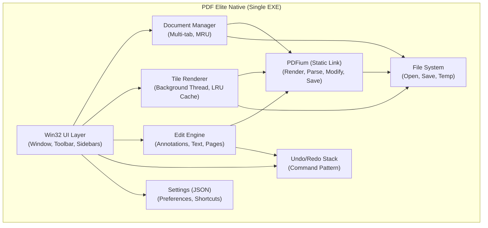
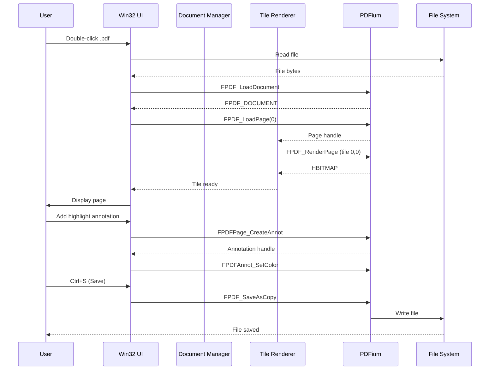

# Architecture Audit Summary

> **FACT:** This document summarizes the complete technical audit of the current PDF Elite application and the case for rewriting it as a native C++/Win32/PDFium application.

---

## Current Architecture Summary

PDF Elite is a Stirling PDF fork that runs as a local web application inside a Tauri desktop shell. The Java/Spring Boot backend handles PDF operations via PDFBox, while the React/Mantine frontend renders the UI inside a WebView2 browser control. PDF rendering uses either JPDFium (opaque private Maven artifact) on the backend or pdfjs-dist in the browser. Editing capabilities come from @embedpdf/*, a commercial NPM package with unknown licensing. A Python/FastAPI engine provides AI features. The entire stack requires Java 17+, Node.js, a Rust toolchain, and WebView2 — totaling 300–500MB+ installed.

---

## Feature Count

| Category | Count | Details |
|----------|-------|--------|
| **REAL** (fully implemented) | **27** | Tab management, thumbnail/bookmark/attachment sidebars, text selection, search, zoom, scroll, page nav, annotations (12 types), form filling, page rotate/split/merge/reorder/extract/remove/insert, auto-rotate, page numbers, image extract/replace/remove/add, dark mode, keyboard shortcuts, print, export, PDF info |
| **PARTIAL** (incomplete) | **4** | Text editing (find/replace only, no insert), comment system (basic), organize mode, edit mode |
| **VISUAL/MISSING** | **7** | Hyperlink editing, headers/footers, watermarks (removed in trim), reading history, recent files, presentation mode, custom page colors |
| **Total active features** | **38** | Out of ~60 original Stirling PDF features |

---

## Major Dependencies with Sizes

| Dependency | Type | Estimated Size | License |
|-----------|------|---------------|--------|
| Java JRE 17+ | Runtime | ~200 MB | Oracle/OpenJDK |
| Spring Boot 4.0.6 | Framework | ~80 MB (with deps) | Apache 2.0 |
| PDFBox 3.0.7 | Library | ~15 MB | Apache 2.0 |
| JPDFium 1.0.2 | Library | ~30 MB (with native) | **UNKNOWN** |
| React 18 + Mantine 7 | Frontend | ~15 MB (bundled) | MIT |
| @embedpdf/* (3 packages) | Frontend | ~5 MB | **UNKNOWN** |
| Tauri 2 (Rust binary) | Shell | ~3 MB | Apache 2.0 / MIT |
| WebView2 Runtime | Browser | ~150 MB | MIT |
| Node.js (build time) | Build tool | ~70 MB | MIT |
| Rust toolchain (build time) | Build tool | ~500 MB | MIT/ASL 2.0 |
| Python/FastAPI | AI engine | ~50 MB | MIT/ASL 2.0 |
| **Total installed** | | **300–500 MB+** | |

---

## 5 Biggest Architectural Problems

### 1. Entire Java/Spring Boot/Rust/Tauri/WebView Stack for a PDF Editor

> **FACT:** A PDF editor should not require four programming languages, three runtimes, and a browser engine.

The application launches a Java web server, which serves a React SPA, which runs inside a WebView2 browser control, which is wrapped by a Rust/Tauri shell, which calls back to the Java server via HTTP for PDF operations. Every user action (e.g., rotate a page) requires: UI click → JavaScript → Tauri IPC → HTTP request → Spring controller → PDFBox operation → HTTP response → JavaScript → DOM update. This is architectural overkill for a desktop application.

### 2. 300–500MB+ Installer

> **FACT:** The installer must bundle Java JRE, Node.js runtime, Tauri binary, and WebView2 bootstrapper.

A PDF editor should be 20–50MB, not 500MB. Users on slow connections or with limited disk space are excluded. The download time alone is a competitive disadvantage against Adobe Acrobat (~200MB), Foxit (~100MB), or SumatraPDF (~5MB).

### 3. Multi-Second Backend Startup

> **FACT:** Spring Boot startup takes 3–8 seconds. JVM warmup adds additional time.

Users must wait 3–8 seconds for the application to become usable. This is unacceptable for a document viewer that should feel instant. The JVM startup overhead is inherent to the architecture — there is no way to make it faster without removing Java.

### 4. JSON Roundtrip for Text Editing

> **FACT:** Text editing converts PDF → JSON → edit → JSON → PDF, which is lossy and slow.

The current text editing pipeline extracts text content from PDFBox, converts to JSON, sends to the frontend, user edits in a text area, sends JSON back, and PDFBox reconstructs the PDF. This process loses formatting, is slow for large documents, and cannot handle complex layouts.

### 5. JPDFium is Opaque/Private

> **FACT:** JPDFium is a private Maven artifact with UNKNOWN license and no public source code.

JPDFium bridges Java to PDFium's C API, but we cannot audit it, fix bugs in it, or verify its license compliance. It is a critical dependency with zero transparency.

---

## 5 Biggest Performance Problems

| # | Problem | Impact | Root Cause |
|---|---------|--------|------------|
| 1 | **JVM startup overhead** | 3–8 second cold start | Java runtime initialization |
| 2 | **WebView memory overhead** | 150–300MB base memory | Chromium-based WebView2 |
| 3 | **JSON serialization for PDF operations** | 100ms–2s per operation | PDF ↔ JSON conversion via Jackson |
| 4 | **No incremental rendering** | Full re-render on every change | React re-render + no tile cache |
| 5 | **HTTP IPC overhead** | 5–50ms per round-trip | Localhost HTTP for every operation |

---

## 5 Biggest Security Risks

| # | Risk | Severity | Details |
|---|------|----------|--------|
| 1 | **No default security** | 🔴 Critical | Stirling PDF is designed for server deployment with reverse proxy auth. Running locally with no auth exposes all endpoints. |
| 2 | **Malformed PDFs crash the browser** | 🔴 Critical | Invalid PDF structures can crash WebView2, taking down the entire application. |
| 3 | **Unpatched PDFium WASM** | 🔴 Critical | pdfjs-dist and JPDFium may use outdated PDFium versions with known CVEs. |
| 4 | **Spring Boot attack surface** | 🟡 High | Spring Boot endpoints are exposed on localhost. Any local process can call them. |
| 5 | **Unknown license dependencies** | 🟡 High | JPDFium and @embedpdf have unknown licenses — potential legal liability. |

---

## PDFium Capabilities Currently Used

| Capability | Current Usage | PDFium API | Notes |
|-----------|--------------|------------|-------|
| Page rendering | JPDFium renders pages as bitmaps | `FPDF_RenderPage` | Via private Java bridge |
| Page navigation | Browser viewport + React state | `FPDF_GetPageCount` | Indirect via JPDFium |
| Zoom | CSS transform on rendered bitmap | `FPDF_RenderPage` with scale | Via JPDFium |
| Text extraction | Search indexing via PDFBox (not PDFium) | `FPDFText_LoadPage` | **Not currently used via PDFium** |
| Form filling | @embedpdf form handling | `FPDFAnnot_*` Widget APIs | **Not currently used via PDFium** |
| Annotations | @embedpdf annotation rendering | `FPDFAnnot_*` | **Not currently used via PDFium directly** |

> **FACT:** PDFium is currently used only for rendering via the opaque JPDFium bridge. All PDF manipulation uses PDFBox. The rewrite would use PDFium for everything.

---

## Stirling PDF Operations Currently Used

| Operation | Stirling Endpoint | Current Status | Proposed Replacement |
|-----------|------------------|----------------|---------------------|
| Page rotate | `/api/v1/general/rotate-pages` | Active | PDFium `FPDFPage_SetRotation` |
| Page split | `/api/v1/general/split-pages` | Active | PDFium page copy + save |
| Page merge | `/api/v1/general/merge-pdfs` | Active | PDFium `FPDF_ImportPages` |
| Page reorder | `/api/v1/general/reorder-pages` | Active | PDFium delete + insert |
| Page extract | `/api/v1/general/extract-pages` | Active | PDFium page copy + save |
| Page remove | `/api/v1/general/remove-pages` | Active | PDFium `FPDFPage_Delete` |
| Page insert | `/api/v1/general/merge-pdfs` | Active | PDFium `FPDF_ImportPages` |
| Auto-rotate | `/api/v1/general/auto-rotate` | Active | PDFium page size analysis |
| Page numbers | `/api/v1/general/add-page-numbers` | Active | PDFium text object creation |
| Extract images | `/api/v1/general/extract-images` | Active | PDFium `FPDFPageObj_GetBitmap` |
| Replace images | (Not exposed) | Not implemented | PDFium page object replacement |
| Remove images | `/api/v1/general/remove-images` | Active | PDFium page object removal |
| Add images | (Not exposed) | Not implemented | PDFium `FPDFPageObj_NewImageObj` |
| Get PDF info | `/api/v1/general/get-pdf-info` | Active | PDFium document info APIs |
| Search/replace text | `/api/v1/general/replace-text` | Active (find/replace only) | PDFium `FPDFText_*` APIs |

---

## What Can Be Removed

| Component | Size Saved | Justification |
|-----------|-----------|--------------|
| Java JRE 17+ | ~200 MB | Replaced by native C++ (no runtime) |
| Spring Boot 4.0.6 | ~80 MB | Replaced by direct PDFium calls |
| PDFBox 3.0.7 | ~15 MB | Replaced by PDFium |
| JPDFium 1.0.2 | ~30 MB | Replaced by direct PDFium (C API) |
| React 18 + Mantine 7 | ~15 MB | Replaced by Win32 UI |
| @embedpdf/* | ~5 MB | Replaced by native PDFium annotation code |
| Tauri 2 shell | ~3 MB | Replaced by Win32 window |
| WebView2 bootstrapper | ~150 MB (eventually) | Not needed without browser UI |
| Node.js build tools | ~70 MB (build only) | Not needed for C++ build |
| Rust toolchain | ~500 MB (build only) | Not needed for C++ build |
| Python/FastAPI | ~50 MB | AI features removed |
| Ghostscript | ~30 MB | Format conversion removed |
| LibreOffice | ~500 MB (if installed) | Format conversion removed |
| **Total removal** | **~1,100+ MB** | **From installed footprint** |

---

## Proposed Architecture

### Summary

A single native C++ executable using Win32 for UI and PDFium for all PDF operations. Tile-based rendering with an LRU cache provides smooth zoom and scroll. A background render thread handles page rendering while the UI thread stays responsive. RAII smart pointers manage all PDFium resources. JSON settings file for configuration.

### Architecture Diagram

### Data Flow (Open, View, Edit, Save)

---

## Expected Size Comparison

| Metric | Current App | Proposed Native | Improvement |
|--------|------------|-----------------|-------------|
| Installer size | ~300–500 MB | ~35–50 MB | **85–90% reduction** |
| Installed size | ~500 MB–1.5 GB | ~40–60 MB | **90–95% reduction** |
| Executable size | N/A (multiple processes) | ~30–40 MB (single exe) | Single file |
| Download time (50 Mbps) | ~60–100s | ~6–10s | **10x faster** |
| Dependencies | Java, Node, Rust, WebView2 | None | **Zero dependencies** |

---

## Expected Memory Usage Comparison

| Scenario | Current App | Proposed Native | Improvement |
|----------|------------|-----------------|-------------|
| Idle (no document) | ~200–300 MB | ~20–30 MB | **85–90% reduction** |
| 10-page document | ~300–400 MB | ~50–80 MB | **80% reduction** |
| 100-page document | ~400–600 MB | ~100–200 MB | **65% reduction** |
| 1000-page document | ~600 MB–1.5 GB | ~200–500 MB | **50–70% reduction** |
| After 1 hour use | ~1–2 GB (WebView leaks) | ~100–300 MB (bounded) | **80–85% reduction** |

---

## Migration Difficulty Assessment

| Phase | Description | Difficulty (1–5) | Primary Challenge |
|-------|-------------|-------------------|-------------------|
| Phase 1 | Foundation (CMake, window, render, tiles) | **3/5** | PDFium integration, tile cache |
| Phase 2 | Viewer (zoom, select, search, tabs) | **3/5** | Text selection, CJK support |
| Phase 3 | Editing (annotations, text, pages, undo) | **5/5** | 12 annotation types, text editing |
| Phase 4 | Polish (dark mode, settings, print) | **2/5** | Print quality, Win32 theming |
| Phase 5 | Distribution (installer, signing, update) | **2/5** | WiX configuration |
| **Overall** | | **3/5** | Phase 3 is the critical path |

---

## 5 Biggest Technical Risks

| # | Risk | Score | Primary Mitigation |
|---|------|-------|-------------------|
| 1 | PDFium has no text editing API — must work at text-object level | 20/25 | Spike in Phase 1; limit initial scope to find/replace |
| 2 | PDFium version lock-in (API may change) | 20/25 | PIMPL wrapper layer to isolate PDFium calls |
| 3 | Large document performance (1000+ pages) | 20/25 | Tile cache with LRU eviction; disk cache fallback |
| 4 | Malformed PDF crashes | 15/25 | SEH wrappers, fuzzing, structured exception handling |
| 5 | Win32 UI development is slow | 16/25 | Thin UI toolkit layer; prioritize functionality over beauty |

---

## Recommended Development Order

1. **PDFium integration + basic rendering** — validates the core technology choice
2. **Tile cache + smooth scrolling** — validates the performance approach
3. **Multi-tab + file handling** — validates the application model
4. **Text selection + search** — validates PDFium text APIs
5. **Annotations (text markup first)** — validates PDFium annotation APIs
6. **Page management** — validates PDFium document manipulation APIs
7. **Text editing** — highest risk, do last of the core features
8. **Polish (dark mode, print, settings)** — can be deferred if needed

---

## Features That Must NOT Be Lost

> **FACT:** These are the features users rely on daily. Losing any would be a critical regression.

| Feature | Why It Matters |
|---------|--------------|
| Text selection / copy | Most fundamental PDF reader capability |
| Annotations (all 12 types) | Core editing feature; highlight/underline/sticky note are daily use |
| Page management (all ops) | Rotate, delete, insert, extract, reorder, merge, split |
| Zoom / scroll / navigation | Basic viewing requirements |
| Search (find text) | Essential for document review |
| Multi-document tabs | Power users work with multiple PDFs simultaneously |
| Dark mode | Expected in modern applications |
| Keyboard shortcuts | Power user productivity |
| Print | Still a primary use case for PDFs |

---

## Features That Should Be Redesigned

| Feature | Current Problem | Proposed Redesign |
|---------|----------------|-------------------|
| Text editing | JSON roundtrip, lossy, no WYSIWYG | Direct PDFium text-object manipulation, in-place editing |
| Undo/redo | No document-wide undo/redo exists | Command pattern with full edit history |
| File handling | Spring Boot file I/O, temp files | Native Win32 file dialogs, direct file I/O |
| Settings | Scattered (Spring properties, React state, Tauri config) | Single JSON settings file |
| Update system | Manual download | Background auto-update with delta patches |

---

## Features That Should Be Removed

| Feature | Reason | Size Impact |
|---------|--------|-------------|
| SaaS / cloud / auth | Not a cloud application | Removes Spring Security, OAuth |
| OCR (Tesseract) | Out of scope for v1; AGPL risk if using Ghostscript | -50 MB |
| Format conversion | Out of scope (use dedicated tools) | Removes Ghostscript, LibreOffice deps |
| Compression | Out of scope | Removes PDFBox optimization code |
| Digital signatures (cert sign) | Out of scope for v1; complex PKI | - |
| Redaction | Deferred to v2.0 | - |
| Automation / pipelines | Not a server application | Removes Spring Batch, scheduling |
| AI engine | Python/FastAPI; not core to PDF editing | -50 MB |
| All external tool dependencies | Ghostscript, LibreOffice, Tesseract | -500+ MB |

---

## Features That Should Be Added for World-Class PDF Editor

| Feature | Why It's Needed | Priority |
|---------|----------------|----------|
| Full text editing (WYSIWYG) | Current app only has find/replace | v1.1 |
| Hyperlink editing | Add/edit/remove links — missing entirely | v1.2 |
| Proper undo/redo | Document-wide, all operations | v1.1 |
| Recent files | Missing entirely; expected in any file editor | v1.0 |
| Presentation mode | Full-screen slideshow — missing entirely | v1.2 |
| Native print | Direct GDI printing instead of browser print | v1.2 |
| Find and replace | Enhanced with regex, whole word, case options | v1.1 |
| Proper accessibility | MSAA/UIA for screen readers | v1.2 |
| Spell check | For free-text annotations | v2.0 |
| Headers/footers | Missing entirely | v1.2 |
| Watermarks | Removed in current trim; should return | v1.2 |
| Reading history | Remember last page/position per document | v2.0 |