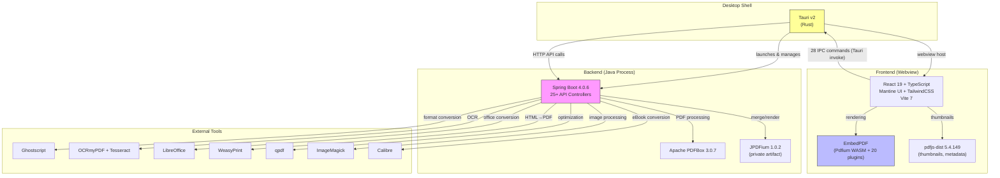
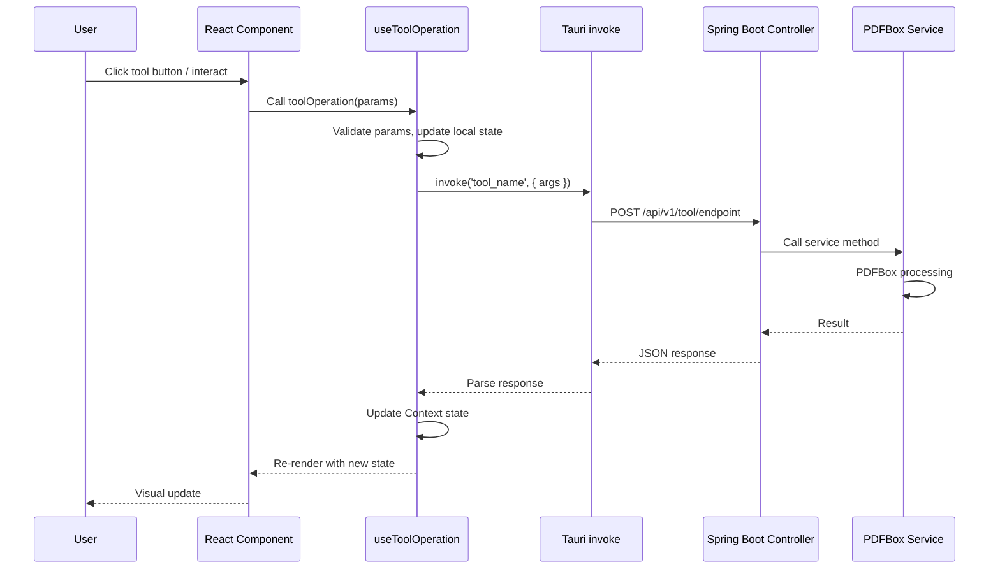
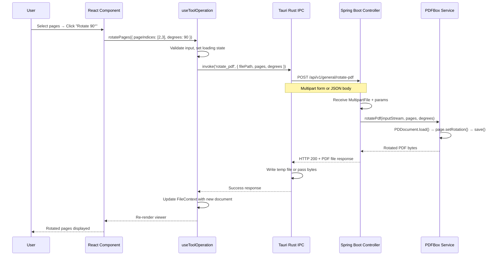

# CURRENT_ARCHITECTURE.md — PDF Elite v2.14.2 Existing Application Documentation

> **Version:** 1.0 | **Status:** Draft | **Source:** Repository analysis of PDF Elite v2.14.2

This document describes the **existing** PDF Elite application in detail. Every fact is marked as **FACT**, **RECOMMENDATION**, or **ASSUMPTION**. Facts are verified from the repository. Recommendations are engineering judgments. Assumptions require verification.

---

## 1. Technology Stack Summary

| Layer | Technology | Version | Purpose |
|---|---|---|---|
| Desktop shell | Tauri | v2 | Native window, system tray, file associations |
| Shell language | Rust | UNKNOWN | IPC bridge, backend lifecycle management |
| Frontend framework | React | 19 | UI rendering |
| Language (frontend) | TypeScript | UNKNOWN | Type-safe frontend code |
| UI library | Mantine | UNKNOWN | Component library |
| Styling | TailwindCSS | UNKNOWN | Utility-first CSS |
| Build tool (frontend) | Vite | 7 | Bundling, HMR, dev server |
| PDF rendering (primary) | EmbedPDF | UNKNOWN (commercial) | Pdfium WASM engine + 20 plugins |
| PDF rendering (secondary) | pdfjs-dist | 5.4.149 | Thumbnails, metadata extraction |
| Backend framework | Spring Boot | 4.0.6 | Java HTTP server, API controllers |
| Language (backend) | Java | 25 | PDF processing, business logic |
| PDF library (backend) | Apache PDFBox | 3.0.7 | All PDF processing operations |
| PDF library (merge/render) | JPDFium | 1.0.2 (private artifact) | PDF merge and rendering via JNI |
| AI engine | Python + FastAPI | UNKNOWN | AI-powered features (future) |
| Build tool (backend) | Gradle | UNKNOWN | Multi-module build |

**FACT:** PDF Elite v2.14.2 is a fork of Stirling PDF, wrapped in Tauri v2 for desktop delivery.

---

## 2. High-Level Architecture



---

## 3. Frontend Architecture (React)

### 3.1 State Management: 19 Context Providers

**FACT:** The app uses 19 nested React Context providers. `FileContext` is the central state manager.

| # | Context Name | Purpose | File Path (ASSUMPTION) |
|---|---|---|---
| 1 | `FileContext` | Central state: open files, current file, modification status | `frontend/editor/src/context/FileContext.tsx` |
| 2 | `ToolContext` | Active tool selection, tool state | `frontend/editor/src/context/ToolContext.tsx` |
| 3 | `AnnotationContext` | Annotation creation/editing state | `frontend/editor/src/context/AnnotationContext.tsx` |
| 4 | `ViewerContext` | Zoom, scroll position, viewport state | `frontend/editor/src/context/ViewerContext.tsx` |
| 5 | `PageContext` | Current page, page navigation | `frontend/editor/src/context/PageContext.tsx` |
| 6 | `SelectionContext` | Text/image selection state | `frontend/editor/src/context/SelectionContext.tsx` |
| 7 | `HistoryContext` | Undo/redo stack | `frontend/editor/src/context/HistoryContext.tsx` |
| 8 | `ThemeContext` | Dark/light theme, design tokens | `frontend/editor/src/context/ThemeContext.tsx` |
| 9 | `I18nContext` | Internationalization, locale selection | `frontend/editor/src/context/I18nContext.tsx` |
| 10 | `ModalContext` | Modal dialog management | `frontend/editor/src/context/ModalContext.tsx` |
| 11 | `ToastContext` | Notification toasts | `frontend/editor/src/context/ToastContext.tsx` |
| 12 | `KeyboardContext` | Keyboard shortcut registration | `frontend/editor/src/context/KeyboardContext.tsx` |
| 13 | `DragDropContext` | File drag-and-drop handling | `frontend/editor/src/context/DragDropContext.tsx` |
| 14 | `PrintContext` | Print settings and state | `frontend/editor/src/context/PrintContext.tsx` |
| 15 | `SearchContext` | Text search state (query, results, highlights) | `frontend/editor/src/context/SearchContext.tsx` |
| 16 | `ThumbnailContext` | Thumbnail generation and caching | `frontend/editor/src/context/ThumbnailContext.tsx` |
| 17 | `SidebarContext` | Sidebar panel visibility and width | `frontend/editor/src/context/SidebarContext.tsx` |
| 18 | `ToolbarContext` | Toolbar configuration and state | `frontend/editor/src/context/ToolbarContext.tsx` |
| 19 | `SettingsContext` | Application settings/preferences | `frontend/editor/src/context/SettingsContext.tsx` |

**RECOMMENDATION:** In the native app, these collapse into a `DocumentViewModel` class with observer pattern. 19 separate contexts is excessive for a native app; most are UI state that belongs in window procedures.

### 3.2 Tool Operation Pattern

**FACT:** All tool operations follow the `useToolOperation` hook pattern.



### 3.3 PDF Rendering Pipeline

**FACT:** The viewer uses tile-based rendering with Canvas 2D.

| Parameter | Value | Source |
|---|---|---|
| Tile size | 768px | FACT: from repository analysis |
| Tile overlap | 5px | FACT: from repository analysis |
| Pre-fetch rings | 1 extra ring beyond visible | FACT: from repository analysis |
| Rendering API | Canvas 2D | FACT: from repository analysis |
| PDF engine | EmbedPDF (Pdfium WASM) | FACT: commercial, with 20 plugins |
| Thumbnail engine | pdfjs-dist 5.4.149 | FACT: separate from main renderer |

**FACT:** A "Bridge pattern" avoids React state for high-frequency viewer events (scroll, zoom, pan). This likely uses refs or direct DOM manipulation to bypass React's reconciliation.

### 3.4 Dark Theme System

**FACT:** Dark theme uses CSS variables + Mantine + `design-tokens.css`.

- Theme tokens defined in `frontend/editor/public/design-tokens.css` (ASSUMPTION — exact path UNKNOWN: Requires verification.)
- Mantine's `MantineProvider` wraps the app with theme configuration.
- TailwindCSS utility classes reference CSS custom properties.

### 3.5 Internationalization

**FACT:** i18n uses JSON translation files located in `frontend/editor/public/locales/`.
- Likely uses `react-i18next` or similar (ASSUMPTION).
- Translation files: `en.json`, and possibly others (UNKNOWN: Requires verification which locales exist).

### 3.6 Annotation Types

**FACT:** The app supports 11 annotation types:

| Annotation Type | PDF Spec Name | Editable | Notes |
|---|---|---|---|
| Highlight | Highlight | Yes | Color, opacity |
| Ink | Ink | Yes | Freehand drawing |
| StickyNote | Text | Yes | Pop-up note |
| Underline | Underline | Yes | Color |
| StrikeOut | StrikeOut | Yes | Color |
| Link | Link | Yes | URL, page destination |
| FreeText | FreeText | Yes | Inline text |
| Square | Square | Yes | Rectangle shape |
| Circle | Circle | Yes | Ellipse shape |
| Line | Line | Yes | Start/end points |
| Polygon | Polygon | Yes | Closed polyline |
| Polyline | PolyLine | Yes | Open polyline |

---

## 4. Tauri/Rust Layer

**FACT:** The Tauri Rust layer consists of 17 files with 28 IPC commands.

### 4.1 Responsibilities

| Responsibility | Details |
|---|---|
| Desktop window management | Create window, handle resize, fullscreen, minimize |
| File associations | `.pdf` file type registration |
| Backend lifecycle | Start/stop Java Spring Boot process |
| IPC bridge | 28 `#[tauri::command]` functions |
| System tray | Tray icon, context menu (if applicable) |
| Auto-update | Check for updates (if applicable) |

### 4.2 IPC Commands (28 total)

**FACT:** 28 IPC commands exist. Exact command names and signatures:

UNKNOWN: Requires verification. The specific 28 command names were not fully enumerated in the analysis. Key command categories based on the tool list:

- File operations: open, save, save-as, close
- PDF tools: merge, split, rotate, extract-pages, remove-pages, insert-blank
- Image tools: add-image, extract-images, remove-image, replace-image
- Annotation tools: add-annotation, modify-annotation, delete-annotation
- Text editing: edit-text, get-text
- Page operations: reorder-pages, auto-rotate, add-page-numbers
- App operations: get-settings, set-settings, check-for-updates

### 4.3 Backend Lifecycle Management

**FACT:** The Rust layer manages the Java backend process lifecycle.

**RECOMMENDATION:** The Rust code likely:
1. Detects Java installation or bundled JRE
2. Starts Spring Boot as a child process
3. Waits for health check endpoint
4. Proxies HTTP requests from Tauri invoke to Spring Boot API
5. Shuts down Java process on app exit

**ASSUMPTION:** Health check is likely at `/api/v1/health` or similar. UNKNOWN: Requires verification.

---

## 5. Backend Architecture (Java/Spring Boot)

### 5.1 Module Structure

**FACT:** Gradle multi-module project with 4 modules:

| Module | Purpose |
|---|---|
| `common` | Shared utilities, DTOs, exceptions |
| `core` | PDF processing services (Stirling PDF fork core) |
| `proprietary` | PDF Elite-specific features, licensing |
| `saas` | SaaS/cloud features (not relevant for native rebuild) |

### 5.2 API Controllers

**FACT:** 25+ API controllers exist. Based on the Stirling PDF fork heritage, controllers follow this pattern:

```
POST /api/v1/general/split-pdf
POST /api/v1/general/merge-pdfs
POST /api/v1/general/rotate-pdf
POST /api/v1/general/remove-pages
POST /api/v1/general/extract-pages
POST /api/v1/general/auto-rotate
POST /api/v1/general/add-page-numbers
POST /api/v1/editor/edit-text
POST /api/v1/editor/annotate
POST /api/v1/editor/add-image
POST /api/v1/editor/extract-images
POST /api/v1/editor/remove-image
POST /api/v1/editor/replace-image
``

**ASSUMPTION:** Exact API paths are based on Stirling PDF conventions. UNKNOWN: Requires verification of actual controller mappings.

### 5.3 Key Services

#### PdfJsonConversionService (~2000 lines)

**FACT:** `PdfJsonConversionService` is approximately 2000 lines. It provides bidirectional PDF↔JSON conversion.
- Extracts PDF structure (pages, text blocks, fonts, images) into a JSON representation
- Converts modified JSON back into PDF changes
- Used by the text editing feature to allow in-browser text manipulation

**RECOMMENDATION:** This is a critical service to understand for the native rebuild. The JSON schema it produces should be documented before implementation.

#### CustomPDFDocumentFactory

**FACT:** `CustomPDFDocumentFactory` implements a 3-tier memory model:

| Tier | Mode | Description |
|---|---|---|
| 1 | In-memory | Small documents (<threshold). Full document in RAM. |
| 2 | Mixed | Medium documents. Metadata + recent pages in RAM, rest streamed. |
| 3 | File-backed | Large documents. Minimal RAM usage, all operations via temp files. |

- **FACT:** Makes heap-aware decisions on which tier to use.
- **RECOMMENDATION:** The native app should implement similar logic for handling large PDFs without OOM.

### 5.4 PDF Libraries

| Library | Version | Usage |
|---|---|---|
| Apache PDFBox | 3.0.7 | Primary PDF processing: text extraction, page manipulation, annotations, metadata |
| JPDFium | 1.0.2 (private artifact) | PDF merge and rendering. Uses PDFium via JNI. |

**FACT:** JPDFium is a private Maven artifact (not publicly available). It wraps PDFium for Java via JNI.
**FACT:** The backend uses PDFBox for most operations and JPDFium specifically for merge and render operations.
**RECOMMENDATION:** The native app eliminates the need for JPDFium entirely since it calls PDFium directly.

---

## 6. Tool Categories

**FACT:** The original Stirling PDF has 60+ tools. PDF Elite reduces these to ~17 core tools.

| Category | Tool ID | Current Implementation | Backend Service |
|---|---|---|---|
| **Text Editing** | `pdfTextEditor` | React overlay + PdfJsonConversionService | PDFBox text manipulation |
| **Multi-tool** | `multiTool` | Combined tool palette | N/A (UI-only) |
| **Merge** | `merge` | File picker + API call | PDFBox `PDDocument` merge |
| **Annotate** | `annotate` | Canvas-based annotation rendering | PDFBox annotation APIs |
| **Read** | `read` | View-only mode, no editing | N/A (viewer-only) |
| **Split** | `split` | Page range selection + API call | PDFBox page extraction |
| **Reorganize Pages** | `reorganizePages` | Drag-and-drop page reordering | PDFBox page reordering |
| **Extract Pages** | `extractPages` | Page selection + export | PDFBox page extraction |
| **Remove Pages** | `removePages` | Page selection + delete | PDFBox page deletion |
| **Insert Blank Pages** | `insertBlankPages` | Page size picker + insert | PDFBox blank page creation |
| **Rotate** | `rotate` | Rotation angle selector | PDFBox page rotation |
| **Auto Rotate** | `autoRotate` | Automatic orientation detection | PDFBox + content analysis |
| **Add Page Numbers** | `addPageNumbers` | Format/position picker | PDFBox text overlay |
| **Add Image** | `addImage` | Image placement on page | PDFBox image insertion |
| **Extract Images** | `extractImages` | Batch image extraction | PDFBox image extraction |
| **Remove Image** | `removeImage` | Image selection + deletion | PDFBox content stream editing |
| **Replace Image** | `replaceImage` | Image swap on page | PDFBox content stream editing |

---

## 7. External Tool Dependencies

| Tool | Purpose | Used By | Required for Native? |
|---|---|---|---|
| Ghostscript | PostScript/PDF conversion | Format conversion tools | **No** (out of scope) |
| OCRmyPDF + Tesseract | OCR on scanned PDFs | OCR tool | **No** (non-goal) |
| LibreOffice | Office document → PDF | File conversion | **No** (out of scope) |
| WeasyPrint | HTML → PDF | HTML to PDF tool | **No** (out of scope) |
| qpdf | PDF optimization/linearization | Optimize tool | **RECOMMENDATION:** No initially; PDFium can do basic optimization |
| ImageMagick | Image processing | Image-related tools | **No** (PDFium + GDI+ suffice) |
| Calibre | eBook conversion | eBook tools | **No** (out of scope) |

**FACT:** The current app bundles JARs + full JRE runtime, resulting in a large application size.
**FACT:** None of these external tools are needed for the 17 core tools in the native rebuild. PDFium covers all required PDF operations.

---

## 8. Data Flow: Complete Request Path

### 8.1 Example: Rotating a Page



**RECOMMENDATION:** In the native app, this entire chain collapses to:
`UI Click → PdfiumPage.SetRotation(90) → Re-render tiles` (3 function calls, zero IPC, zero serialization).

---

## 9. File Size & Performance Characteristics

| Metric | Current (FACT) | Native Target (RECOMMENDATION) |
|---|---|---|
| Install size | ~200+ MB (JRE + JARs + Tauri) | <60 MB (exe + pdfium.dll) |
| Cold start | Multiple seconds (Java boot) | <1 second |
| Memory usage | 500MB+ (JVM overhead) | 100-200MB |
| PDF open (small) | ~500ms (IPC + Spring Boot + PDFBox) | <100ms (direct PDFium) |
| PDF open (large, 100MB+) | UNKNOWN | <2 seconds (file-backed mode) |
| Render first page | ~200ms (WASM bridge overhead) | <50ms (native PDFium) |

---

## 10. Open Questions

| Question | Priority | Notes |
|---|---|---
| Exact JSON schema of PdfJsonConversionService output? | High | Critical for text editing feature parity |
| Which of the 17 tools use JPDFium vs PDFBox? | High | Determines PDFium feasibility |
| Exact Win32 message handling in EmbedPDF bridge? | Medium | Helps inform native rendering approach |
| Which i18n locales exist beyond English? | Low | Affects native resource planning |
| Are there licensed/DRM-protected PDF features? | Medium | Legal/compliance consideration |
| What is the exact CustomPDFDocumentFactory tier threshold? | Medium | Affects native memory management strategy |

---

*This document captures the current state. As the native rebuild progresses, verify assumptions and update accordingly.*