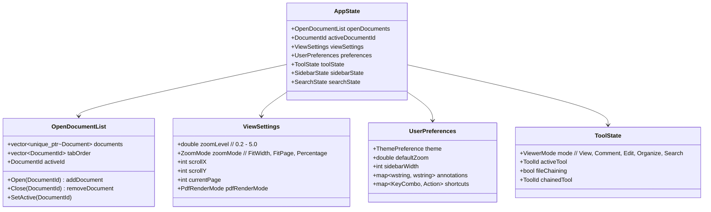

# Data Model: Current & Proposed C++ Structures

> **Document ID:** FILE-012 | **Status:** DRAFT | **Depends on:** ARCHITECTURE.md, PDF_ENGINE.md

---

## Table of Contents

1. [Current Data Model (React/TypeScript)](#1-current-data-model-reacttypescript)
2. [Proposed C++ Core Models](#2-proposed-c-core-models)
3. [Application State Model](#3-application-state-model)
4. [Ownership Rules (RAII)](#4-ownership-rules-raii)
5. [Undo/Redo Data Model (Command Pattern)](#5-undoredo-data-model-command-pattern)
6. [Clipboard Data Model](#6-clipboard-data-model)
7. [Thread-Safe Access Patterns](#7-thread-safe-access-patterns)
8. [Persistence Model](#8-persistence-model)

---

## 1. Current Data Model (React/TypeScript)

### 1.1 FileContext — Central File State

> **FACT:** `FileContext` is the most complex state container. It uses a normalized entity map (`files.byId`), splits state and actions into separate contexts, stores `Blob` references in `useRef`, and provides selectors for derived state.

```typescript
// Simplified from src/contexts/FileContext.tsx
interface FileState {
  byId: Record<string, StirlingFileStub>;
  activeFileId: string | null;
  openOrder: string[];  // tab order
}

interface StirlingFileStub {
  id: string;
  name: string;
  size: number;
  mimeType: string;
  blob: Blob;              // stored in useRef, NOT in React state
  lastViewedPage: number;
  isModified: boolean;
  openedAt: number;        // timestamp
}
```

> **FACT:** The `Blob` is stored in `useRef` because placing a `Blob` in React state causes unnecessary serialization. The `StirlingFileStub` in state holds only metadata. This is an important optimization to replicate in C++ — file data (the byte buffer) should be owned separately from metadata.

### 1.2 PDF Document Model (EmbedPDF)

```typescript
// Used internally by EmbedPDF plugins
interface PdfJsonDocument {
  pages: PdfJsonPage[];
  metadata: {
    title: string;
    author: string;
    subject: string;
    keywords: string;
    creator: string;
    producer: string;
    creationDate: string;
    modificationDate: string;
  };
}

interface PdfJsonPage {
  index: number;
  width: number;   // points
  height: number;  // points
  rotation: number; // 0, 90, 180, 270
  textElements: PdfJsonTextElement[];
  imageElements: PdfJsonImageElement[];
  annotations: PdfJsonAnnotation[];
  formFields: PdfJsonFormField[];
}

interface PdfJsonTextElement {
  bounds: { x: number; y: number; width: number; height: number };
  text: string;
  fontSize: number;
  fontName: string;
  color: string;  // hex
}

interface PdfJsonImageElement {
  bounds: { x: number; y: number; width: number; height: number };
  dataUrl: string;  // base64-encoded image
  mimeType: string;
}
```

### 1.3 Annotation Model (React)

```typescript
interface Annotation {
  id: string;
  type: 'Highlight' | 'Underline' | 'StrikeOut' | 'Ink' | 'StickyNote'
       | 'Link' | 'FreeText' | 'Square' | 'Circle' | 'Line'
       | 'Polygon' | 'Polyline';
  pageIndex: number;
  rect: { x: number; y: number; width: number; height: number };
  color: string;
  opacity: number;
  contents: string;        // text content (StickyNote, FreeText)
  author: string;
  modificationDate: string;
  // Type-specific
  inkPaths?: { points: {x: number; y: number}[] }[];  // Ink
  lineWidth?: number;      // Ink, Line, FreeText border
  quadPoints?: {x: number; y: number}[];  // Highlight, Underline, StrikeOut
  lineStart?: {x: number; y: number};  // Line
  lineEnd?: {x: number; y: number};    // Line
}
```

---

## 2. Proposed C++ Core Models

### 2.1 Document

```cpp
struct DocumentId {
    uint64_t value;
    bool operator==(const DocumentId&) const = default;
    bool operator<(const DocumentId&) const = default;
};

// RAII wrapper around PDFium FPDF_DOCUMENT
// Owns the PDFium document handle and the file data buffer
struct Document {
    DocumentId id;
    std::wstring filePath;
    std::wstring fileName;
    uint64_t fileSize;
    std::vector<uint8_t> fileData;    // owns the original file bytes
    FPDF_DOCUMENT handle = nullptr;    // PDFium document handle
    bool isModified = false;
    bool isEncrypted = false;
    bool requiresPassword = false;
    int pageCount = 0;

    // Metadata
    std::wstring title;
    std::wstring author;
    std::wstring subject;
    std::wstring keywords;
    std::wstring creator;
    std::wstring producer;
    FILETIME creationDate{};
    FILETIME modificationDate{};

    ~Document() {
        if (handle) FPDF_CloseDocument(handle);
    }
    // Non-copyable, movable
    Document(const Document&) = delete;
    Document& operator=(const Document&) = delete;
    Document(Document&&) noexcept;
    Document& operator=(Document&&) noexcept;
};
```

### 2.2 Page

```cpp
struct PageId {
    int documentIndex;  // which open document
    int pageIndex;      // 0-based page within document
};

struct PageInfo {
    int pageIndex;
    double width;     // points (1/72 inch)
    double height;    // points
    int rotation;     // 0, 90, 180, 270
    double mediaBox[4];  // PDF media box in points
    double cropBox[4];   // PDF crop box in points
};
```

> **RECOMMENDATION:** Do **not** store all page text elements in memory eagerly. Extract text on demand via `FPDFText_GetText` when needed (search, copy, selection). Only cache the result. This matches the current behavior where `PdfJsonPage.textElements` is populated lazily by EmbedPDF plugins.

### 2.3 TextElement

```cpp
struct TextRect {
    double x, y, width, height;  // PDF coordinate space (points, origin bottom-left)
};

struct TextSelection {
    int pageIndex;
    int startCharIndex;
    int endCharIndex;
    std::vector<TextRect> rects;   // screen-space quads for rendering highlight
    std::wstring text;             // extracted text
};
```

### 2.4 Annotation

```cpp
enum class AnnotationType : uint8_t {
    Highlight, Underline, StrikeOut, Ink, StickyNote,
    Link, FreeText, Square, Circle, Line, Polygon, Polyline
};

struct Annotation {
    int id;  // application-unique annotation ID
    AnnotationType type;
    int pageIndex;
    RECTF rect;          // PDF rect in points {left, top, right, bottom}
    COLORREF color;
    float opacity;
    std::wstring contents;
    std::wstring author;
    FILETIME modificationDate;

    // Type-specific data (use std::variant or optional fields)
    std::vector<std::vector<POINTF>> inkPaths;  // Ink
    float lineWidth = 1.0f;                      // Ink, Line, FreeText
    std::vector<POINTF> quadPoints;              // Highlight, Underline, StrikeOut
    POINTF lineStart, lineEnd;                   // Line
    std::vector<POINTF> vertices;                // Polygon, Polyline

    // PDFium handle (owned by the document, NOT by this struct)
    FPDF_ANNOTATION pdfiumHandle = nullptr;
};
```

### 2.5 FormField

```cpp
enum class FormFieldType : uint8_t {
    None, PushButton, CheckBox, RadioButton,
    TextField, DropDownList, ListBox, Signature
};

struct FormField {
    int pageIndex;
    RECTF rect;              // field bounds in points
    FormFieldType type;
    std::wstring name;       // PDF field name
    std::wstring value;      // current value
    std::wstring defaultValue;
    bool isReadOnly;
    bool isRequired;
    int fontSize;
    COLORREF textColor;
    COLORREF backgroundColor;
    std::vector<std::wstring> options;  // for DropDownList, ListBox
    std::vector<int> selectedIndices;   // for ListBox multi-select
    FPDF_FORMHANDLE pdfiumHandle = nullptr;
};
```

---

## 3. Application State Model

### 3.1 State Hierarchy



### 3.2 ViewSettings Detail

```cpp
enum class ZoomMode { FitWidth, FitPage, Percentage };
enum class PdfRenderMode { Normal, Dark, Sepia };

struct ViewSettings {
    // Per-document view state
    ZoomMode zoomMode = ZoomMode::FitWidth;
    double zoomLevel = 1.0;        // 0.2 to 5.0
    int scrollPosX = 0;             // pixels
    int scrollPosY = 0;             // pixels
    int currentPage = 1;            // 1-based
    PdfRenderMode pdfRenderMode = PdfRenderMode::Normal;

    // Computed (not persisted)
    double dpiScale = 1.0;          // from monitor DPI
    double pixelsPerPoint = 1.0;    // zoom * dpiScale / 72.0
};
```

> **FACT:** The current app defaults to `FitWidth` zoom mode. This maps to calculating `zoomLevel` such that the page width fills the canvas width minus padding. When the window resizes, `FitWidth` recalculates automatically.

### 3.3 Per-Document State

```cpp
struct PerDocumentState {
    ViewSettings viewSettings;
    int lastViewedPage = 1;        // persisted via PageMemoryService
    std::vector<Annotation> annotations;  // unsaved annotations
    std::vector<RedactionMark> pendingRedactions;
    std::unordered_map<int, std::vector<TextSelection>> selections;  // per-page
    CommandHistory undoHistory;
    CommandHistory redoHistory;
};

// Stored in a map keyed by DocumentId
std::unordered_map<DocumentId, PerDocumentState> documentStates_;
```

---

## 4. Ownership Rules (RAII)

### 4.1 Ownership Table

| Resource | Owner | Lifetime | Cleanup |
|----------|-------|----------|--------|
| `FPDF_DOCUMENT` handle | `Document` struct | Until `Document` is destroyed | `FPDF_CloseDocument()` in destructor |
| `FPDF_PAGE` handle | `PageRenderTask` (transient) | During render only | `FPDF_ClosePage()` after render |
| `FPDF_ANNOTATION` handle | Owned by `FPDF_DOCUMENT` | Document lifetime | Do NOT close manually (PDFium owns it) |
| `FPDF_FORMHANDLE` | `FormController` | Document lifetime | `FPDFDOC_InitFormFillEnvironment()` / `...CloseFormFillEnvironment()` |
| `FPDF_TEXTPAGE` | `TextExtractor` (transient) | During text extraction | `FPDFText_CloseTextPage()` |
| `ID2D1Bitmap` (tile) | `TileCache` | Until evicted by LRU | `Release()` when evicted |
| `ID2D1Bitmap` (thumbnail) | `ThumbnailService` cache | Until evicted by LRU | `Release()` when evicted |
| File data (`vector<uint8_t>`) | `Document` struct | Document lifetime | Automatic RAII |
| Annotations (app model) | `PerDocumentState` | Until document closed | Automatic RAII |

> **FACT:** PDFium annotation handles (`FPDF_ANNOTATION`) are owned by the document. Calling `FPDFPage_CloseAnnot()` removes the annotation from the document. Never store annotation handles across operations without re-acquiring them.

### 4.2 RAII Wrappers

```cpp
// RAII wrapper for FPDF_PAGE
class ScopedPage {
    FPDF_PAGE page_ = nullptr;
public:
    explicit ScopedPage(FPDF_DOCUMENT doc, int index)
        : page_(FPDF_LoadPage(doc, index)) {}
    ~ScopedPage() { if (page_) FPDF_ClosePage(page_); }
    FPDF_PAGE Get() const { return page_; }
    operator bool() const { return page_ != nullptr; }
    // Non-copyable
    ScopedPage(const ScopedPage&) = delete;
    ScopedPage& operator=(const ScopedPage&) = delete;
};

// RAII wrapper for FPDF_TEXTPAGE
class ScopedTextPage {
    FPDF_TEXTPAGE textPage_ = nullptr;
public:
    explicit ScopedTextPage(FPDF_PAGE page)
        : textPage_(FPDFText_LoadTextPage(page)) {}
    ~ScopedTextPage() { if (textPage_) FPDFText_CloseTextPage(textPage_); }
    FPDF_TEXTPAGE Get() const { return textPage_; }
};

// RAII wrapper for FPDF_BITMAP
class ScopedBitmap {
    FPDF_BITMAP bitmap_ = nullptr;
public:
    explicit ScopedBitmap(int width, int height, int format = FPDFBitmap_BGRA)
        : bitmap_(FPDFBitmap_Create(width, height, format == FPDFBitmap_BGRA)) {}
    ~ScopedBitmap() { if (bitmap_) FPDFBitmap_Destroy(bitmap_); }
    FPDF_BITMAP Get() const { return bitmap_; }
    void* GetBuffer() const { return FPDFBitmap_GetBuffer(bitmap_); }
    int GetStride() const { return FPDFBitmap_GetStride(bitmap_); }
};
```

---

## 5. Undo/Redo Data Model (Command Pattern)

### 5.1 Command Interface

```cpp
class Command {
public:
    virtual ~Command() = default;
    virtual void Execute() = 0;
    virtual void Undo() = 0;
    virtual std::wstring Description() const = 0;
};
```

### 5.2 Command Types

| Command | Execute | Undo | Data Captured |
|---------|---------|------|---------------|
| `AddAnnotationCommand` | Add annotation to document | Remove annotation | Full `Annotation` struct (before null) |
| `DeleteAnnotationCommand` | Remove annotation from document | Re-add annotation | Full `Annotation` struct (before deletion) |
| `ModifyAnnotationCommand` | Apply new properties | Restore old properties | `Annotation` before + after |
| `RotatePageCommand` | Set page rotation | Restore previous rotation | Page index, old rotation, new rotation |
| `MovePageCommand` | Reorder page | Reorder back | Old index, new index |
| `DeletePageCommand` | Remove page | Re-insert page | Page content (or re-parse from file data) |
| `FillFormFieldCommand` | Set field value | Restore old value | Field name, old value, new value |
| `ApplyRedactionCommand` | Remove redacted content | Cannot undo (destructive) | — |

### 5.3 Command History

```cpp
class CommandHistory {
    std::vector<std::unique_ptr<Command>> undoStack_;
    std::vector<std::unique_ptr<Command>> redoStack_;
    size_t maxSize_ = 100;  // limit memory usage

public:
    void Execute(std::unique_ptr<Command> cmd);
    bool CanUndo() const { return !undoStack_.empty(); }
    bool CanRedo() const { return !redoStack_.empty(); }
    void Undo();
    void Redo();
    void Clear();
};
```

> **RECOMMENDATION:** Redaction should be **non-undoable**. Show a confirmation dialog before applying. The current `RedactionPendingTracker` shows red marks before application — the `ApplyRedactionCommand` is the point of no return.

---

## 6. Clipboard Data Model

### 6.1 Clipboard Formats

| Format | Registered Name | Data | Source Operation |
|--------|----------------|------|-----------------|
| Text | `CF_UNICODETEXT` | Selected PDF text as UTF-16 | Copy from text selection |
| HTML | `CF_HTML` | Text with minimal HTML markup | Copy from text selection (rich) |
| Image | `CF_DIB` | Selected area as device-independent bitmap | Copy from page region |
| Annotation | Custom: `L"PdfElite/Annotation"` | Serialized `Annotation` struct (JSON) | Copy annotation |
| Page Image | `CF_DIBV5` | Full page rendered to bitmap | Copy page |

### 6.2 Clipboard Implementation

```cpp
class ClipboardManager {
public:
    void CopyText(const std::wstring& text);
    void CopyHtml(const std::wstring& html, const std::wstring& plainText);
    void CopyImage(HBITMAP hBitmap);  // caller transfers ownership
    void CopyAnnotation(const Annotation& annot);

    bool CanPaste() const;  // checks clipboard for any supported format
    std::wstring GetText() const;
    std::optional<Annotation> GetAnnotation() const;
};
```

> **ASSUMPTION:** Paste annotation is v1 scope only if implementing annotation copy between documents. Register the custom format with `RegisterClipboardFormat(L"PdfElite/Annotation")` at startup.

---

## 7. Thread-Safe Access Patterns

### 7.1 Access Rules by Thread

| Data | UI Thread | Render Worker | File I/O Thread | Search Thread |
|------|-----------|---------------|-----------------|---------------|
| `AppState` (tool, mode, prefs) | Read/Write | — | — | — |
| `Document` metadata | Read | Read | — | Read |
| `Document` fileData | — | — | Read (during open) | — |
| `FPDF_DOCUMENT` handle | — | Read (locked) | — | Read (locked) |
| `PerDocumentState` | Read/Write | — | — | — |
| `TileCache` bitmaps | Read (D2D draw) | Write (add tile) | — | — |
| Text cache | Read | — | — | Write (search populates) |
| Thumbnail cache | Read | Write | — | — |

### 7.2 Synchronization Strategy

> **FACT:** The current app has threading issues by design — WebView is single-threaded, Java backend uses virtual threads, Web Workers are isolated. The main bottleneck is the JSON roundtrip between WebView and Java.

```cpp
// Per-document PDFium lock
class DocumentLock {
    SRWLOCK lock_ = SRWLOCK_INIT;
public:
    void LockShared()  { AcquireSRWLockShared(&lock_); }
    void LockExclusive() { AcquireSRWLockExclusive(&lock_); }
    void UnlockShared()  { ReleaseSRWLockShared(&lock_); }
    void UnlockExclusive() { ReleaseSRWLockExclusive(&lock_); }
};

// Usage: Render workers acquire shared lock (multiple readers OK)
// UI thread acquires exclusive lock only for structural changes
// (add/delete page, apply redaction)
```

### 7.3 Immutable Data Sharing

> **RECOMMENDATION:** Share read-only data between threads via `std::shared_ptr` to immutable structs. No locking needed for immutable data.

```cpp
// Page info is immutable once loaded
using PageInfoPtr = std::shared_ptr<const PageInfo>;

// Thumbnail is immutable once rendered
using ThumbnailPtr = std::shared_ptr<const ID2D1Bitmap>;
```

### 7.4 Thread-Safe Event Dispatch

```cpp
// Events from worker threads must be posted to UI thread
void PostToUIThread(std::function<void()> task) {
    PostMessage(g_hwndMain, WM_APP_CALLBACK, 0,
                reinterpret_cast<LPARAM>(new std::function<void()>(std::move(task))));
}

// In WndProc:
case WM_APP_CALLBACK: {
    auto* task = reinterpret_cast<std::function<void()>*>(lParam);
    (*task)();
    delete task;
    break;
}
```

---

## 8. Persistence Model

### 8.1 Current: IndexedDB + localStorage

| Data | Current Store | Key/Path | Size |
|------|--------------|----------|------|
| File metadata | IndexedDB | `pdf-elite-files` | Per-document |
| File blobs | IndexedDB | `pdf-elite-blobs` | Full file size |
| Thumbnails | IndexedDB | `pdf-elite-thumbnails` | 1GB session cache |
| Preferences | localStorage | `preferences` | ~2KB |
| Hotkeys | localStorage | `hotkeys` | ~1KB |
| Last-viewed page | localStorage | `page-memory` | ~500B |

> **FACT:** The current IndexedDB persistence serves two purposes: (1) offline file access (PWA), and (2) remembering open documents across sessions. In a native app, files live on the filesystem — IndexedDB is unnecessary.

### 8.2 Proposed: Filesystem + JSON Config

| Data | Store | Location | Format |
|------|-------|----------|--------|
| Files | Filesystem | User's Documents or last-opened path | Original PDF files |
| Preferences | JSON file | `%APPDATA%\PdfElite\preferences.json` | JSON |
| Hotkeys | JSON file | `%APPDATA%\PdfElite\hotkeys.json` | JSON |
| Recent files | JSON file | `%APPDATA%\PdfElite\recent.json` | JSON (max 20) |
| Last-viewed page | JSON file | `%APPDATA%\PdfElite\page-memory.json` | JSON |
| Thumbnails | Memory only | LRU cache in RAM | Not persisted (regenerated) |
| Window state | JSON file | `%APPDATA%\PdfElite\window-state.json` | JSON |

### 8.3 Preferences JSON Schema

```json
{
  "theme": "system",
  "defaultZoom": "FitWidth",
  "pdfRenderMode": "normal",
  "sidebarWidth": 240,
  "rightPanelWidth": 300,
  "showPageLabels": true,
  "smoothScrolling": true,
  "hardwareAcceleration": true,
  "maxTileCacheMB": 512,
  "renderWorkerCount": 2
}
```

### 8.4 Page Memory JSON Schema

```json
{
  "C:\Users\user\Documents\report.pdf": {
    "lastPage": 42,
    "zoomLevel": 1.5,
    "zoomMode": "Percentage",
    "scrollX": 0,
    "scrollY": 1234,
    "pdfRenderMode": "normal"
  }
}
```

> **FACT:** The current `PageMemoryService` uses the file path (or ID) as key and stores only `lastViewedPage`. The native version can additionally persist zoom level and scroll position, which is cheap to store and improves the "resume where you left off" experience.

### 8.5 Window State JSON Schema

```json
{
  "windowX": 100,
  "windowY": 100,
  "windowWidth": 1280,
  "windowHeight": 800,
  "windowState": "normal",
  "leftRailWidth": 240,
  "rightPanelWidth": 300,
  "leftRailVisible": true,
  "rightPanelVisible": false
}
```

> **RECOMMENDATION:** Save window state on `WM_CLOSE` and restore on startup. Use `GetWindowPlacement` / `SetWindowPlacement` to handle maximized/minimized states correctly, including multi-monitor scenarios. Validate that the saved position is within current monitor bounds on restore (monitor may have been disconnected).

---

*End of FILE-012: DATA_MODEL.md*
    