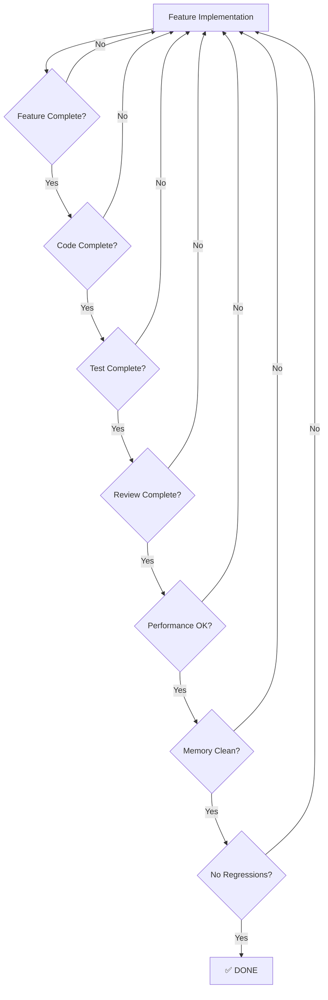

# Definition of Done

> **FACT:** This document defines the criteria that must be met before any feature, phase, or release is considered complete.
> **RECOMMENDATION:** No feature should be marked "done" until ALL applicable criteria below are satisfied.

---

## Checklist Overview

---

## 1. Feature Complete

| Criterion | Description | Verification |
|-----------|-------------|-------------|
| Acceptance criteria met | All acceptance criteria from the feature spec are satisfied | QA sign-off on spec checklist |
| User-facing behavior correct | The feature works as described in PRODUCT_SPEC.md | Manual testing against spec |
| Edge cases handled | Empty documents, single-page, 1000+ pages, malformed input | Test cases exist and pass |
| Error states handled | Meaningful error messages for all failure modes | Manual testing of error paths |
| Keyboard accessible | All feature actions accessible via keyboard | Tab/Enter/Space navigation test |
| No placeholder code | No `TODO`, `FIXME`, `HACK`, or stub implementations | Code search returns zero results |

---

## 2. Code Complete

| Criterion | Description | Verification |
|-----------|-------------|-------------|
| Follows coding standards | Compliant with CODING_STANDARDS.md | Automated clang-format check |
| No compiler warnings | Zero warnings with `/W4 /WX` | CI build log |
| No static analysis issues | Zero issues from `/analyze` (MSVC) | CI static analysis report |
| Header includes minimal | No unnecessary includes, forward declarations used where possible | Include-what-you-use check |
| RAII everywhere | All resources (handles, memory, GDI objects) use RAII | Code review |
| No raw `new`/`delete` | Use `std::make_unique`, `std::make_shared`, containers | Code review + compiler flag |
| No C-style casts | Use `static_cast`, `dynamic_cast`, `reinterpret_cast` only | Compiler warning `/W3` catches some; code review for rest |
| Const correctness | All parameters and methods that can be `const` are `const` | Compiler enforces |
| Documented public API | All public classes/functions have Doxygen comments | Doxygen build succeeds |

---

## 3. Test Complete

| Criterion | Description | Verification |
|-----------|-------------|-------------|
| Unit tests pass | All unit tests for the feature pass | CI test run: green |
| Unit test coverage | New code has ≥ 80% line coverage | Coverage report |
| Integration tests pass | End-to-end tests for the feature pass | CI integration test run: green |
| Golden PDF tests pass | Output PDFs match reference PDFs (pixel-exact or structured) | Golden test comparison |
| Regression tests pass | All existing tests still pass | Full CI test suite: green |
| Fuzzing tests | Fuzzing harness runs for 1 hour without crashes | libFuzzer / AFL report |
| Test on real PDFs | Feature tested against the PDF regression test suite (100+ PDFs) | Manual test report |

### Golden PDF Test Requirements

> **FACT:** PDF comparison is non-trivial because metadata, IDs, and encoding may differ between saves.
> **RECOMMENDATION:** Use structured comparison (page count, text content, annotation count) plus pixel comparison at 150 DPI.

| Comparison Type | Tool | Threshold |
|----------------|------|----------|
| Page count | PDFium `FPDF_GetPageCount` | Exact match |
| Text content | PDFium `FPDFText_GetText` | Exact match |
| Page dimensions | PDFium `FPDF_GetPageWidth/Height` | ±1 pixel |
| Pixel comparison | Rendered bitmap diff | ≤ 0.1% pixel difference |
| Annotation count | PDFium `FPDFPage_GetAnnotCount` | Exact match |
| File size | `GetFileSize` | Within 10% of reference |

---

## 4. Review Complete

| Criterion | Description | Verification |
|-----------|-------------|-------------|
| Code review | At least one other developer has reviewed the code | PR approval in Git |
| Architecture review | For new modules/components, architecture is reviewed | Architecture sign-off |
| Security review | For features handling untrusted input (file open, paste) | Security checklist completed |
| UX review | UI changes reviewed for consistency and usability | Designer sign-off |

---

## 5. Performance

| Metric | Target | Measurement |
|--------|--------|-------------|
| Cold start (no file) | < 500ms | `QueryPerformanceCounter` from process start to window visible |
| PDF open (10-page) | < 200ms | From `FPDF_LoadDocument` to first page rendered |
| PDF open (100-page) | < 500ms | From `FPDF_LoadDocument` to first page rendered |
| PDF open (1000-page) | < 2s | From `FPDF_LoadDocument` to first page rendered |
| Page render (72 DPI) | < 16ms | Single page at 72 DPI (60fps) |
| Page render (150 DPI) | < 50ms | Single page at 150 DPI |
| Page render (300 DPI) | < 150ms | Single page at 300 DPI |
| Zoom change | < 100ms | From zoom input to visible result |
| Search (100 pages) | < 500ms | Full document text search |
| Save (unmodified) | < 500ms | `FPDF_SaveAsCopy` for 100-page document |
| Save (with edits) | < 2s | After 50 annotation edits on 100-page document |
| Memory idle (no doc) | < 30 MB | Process private bytes, no document open |
| Memory (100-page doc) | < 200 MB | Process private bytes, 100-page document at 100% zoom |
| Memory (1000-page doc) | < 500 MB | Process private bytes with tile cache eviction |

---

## 6. Memory Clean

| Criterion | Description | Verification |
|-----------|-------------|-------------|
| No memory leaks | Zero leaks detected by Application Verifier or heap debug | Full session leak check |
| AddressSanitizer clean | Zero ASan errors in debug builds | CI runs with `/fsanitize=address` |
| GDI object cleanup | All `HBRUSH`, `HPEN`, `HFONT`, `HBITMAP` released | GDI object count stable after repeated operations |
| HANDLE cleanup | All `HANDLE` (file, event, mutex) closed | Handle leak detection |
| Tile cache bounded | Tile cache stays within configured memory limit | Memory profiling under load |

### Leak Detection Protocol

1. Open a 100-page document
2. Scroll through all pages
3. Zoom in and out 10 times
4. Create 5 annotations
5. Undo all annotations
6. Close the document
7. Repeat steps 1–6 ten times
8. Verify private bytes have not grown > 5% from cycle 1 to cycle 10

---

## 7. Threading

| Criterion | Description | Verification |
|-----------|-------------|-------------|
| No data races | Zero ThreadSanitizer errors | CI runs with `/fsanitize=thread` |
| No deadlocks | No deadlocks detected under stress testing | Lock order validation + stress test |
| UI thread responsive | UI never blocks for > 100ms | Input latency measurement |
| Background tasks cancelable | All background operations can be cancelled | Cancel during long operation |
| Safe shutdown | Clean shutdown with background tasks in progress | Close app during render/search |

---

## 8. Accessibility

| Criterion | Description | Verification |
|-----------|-------------|-------------|
| Keyboard navigable | All UI elements reachable via Tab | Keyboard-only navigation test |
| Screen reader compatible | NVDA can read document text and UI elements | NVDA testing |
| High contrast | UI readable in Windows High Contrast mode | Visual inspection |
| Focus indicators | Visible focus rectangle on all interactive elements | Visual inspection |
| Minimum touch target | 44×44 pixel minimum touch targets | Measurement tool |

---

## 9. Documentation

| Criterion | Description | Verification |
|-----------|-------------|-------------|
| Feature documented | User-facing feature described in user guide | Documentation PR |
| API documented | Public C++ APIs have Doxygen comments | Doxygen build |
| Settings documented | All settings options explained | Settings reference |
| Changelog updated | Feature listed in CHANGELOG.md | PR includes changelog |

---

## 10. Install/Uninstall

| Criterion | Description | Verification |
|-----------|-------------|-------------|
| Install succeeds | Clean install on Windows 10 and 11 | Test on clean VMs |
| Uninstall clean | No files, registry keys, or services remain | Post-uninstall scan |
| File association works | Double-click .pdf opens in PDF Elite | File association test |
| Upgrade path | Upgrade from previous version preserves settings | Install-over-old-version test |
| Portable mode | Works from USB drive without installation | Portable mode test |

---

## 11. No Regressions

| Criterion | Description | Verification |
|-----------|-------------|-------------|
| All existing tests pass | Full test suite green | CI test run |
| PDF regression suite | All 100+ test PDFs open and render correctly | Automated regression test |
| Performance not degraded | No performance metric degraded > 10% from baseline | Benchmark comparison |
| No new crash bugs | No crashes on any test PDF | Automated crash detection |

---

## Phase-Specific Definition of Done

### Phase Done (applies to each migration phase)

- [ ] All features in phase scope meet the above criteria
- [ ] Application builds without errors or warnings
- [ ] Installer packages successfully
- [ ] Installer installs, runs, and uninstalls cleanly
- [ ] All known bugs are triaged (P0: 0, P1: < 3, P2: tracked)
- [ ] Performance targets met for all metrics in the phase
- [ ] Release notes prepared
- [ ] Demo video recorded (for stakeholder review)