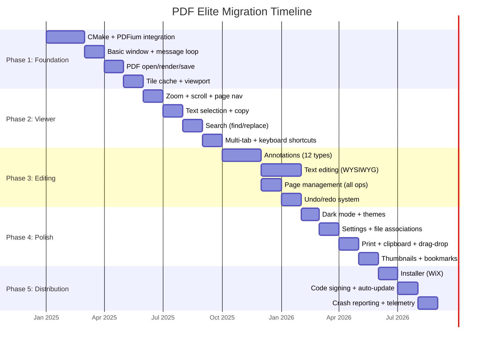

# Migration Plan: Java/Tauri → C++/PDFium Native Windows Application

> **FACT:** The current application is a Stirling PDF fork with a Java/Spring Boot backend, React/Mantine frontend, and Rust/Tauri/WebView2 desktop shell.
> **FACT:** The target is a native C++/Win32/PDFium Windows application with zero external runtime dependencies.
> **RECOMMENDATION:** Each phase must produce a buildable, shippable application to allow early testing and user feedback.

---

## Complete Migration Table

| # | Feature | Current Impl | Proposed Impl | Deps to Remove | New Deps | Difficulty | Test Reqs |
|---|---------|-------------|---------------|----------------|----------|------------|-----------|
| 1 | Tab management | React state + Tauri IPC | Win32 MDI tabs | React, Tauri | Win32 API | Medium | Multi-tab open/close/switch |
| 2 | Thumbnail sidebar | Mantine ScrollArea + Canvas | Win32 ListView + PDFium render | Mantine, React | Win32 ListView | Medium | 100+ page doc, scroll perf |
| 3 | Bookmark sidebar | Mantine Tree + PDFBox parse | Win32 TreeView + PDFium | Mantine, React, PDFBox | Win32 TreeView | Low | Nested bookmarks, navigation |
| 4 | Attachment sidebar | Mantine List + PDFBox | Win32 ListView + PDFium | Mantine, React, PDFBox | PDFium attachments API | Low | Embed/extract files |
| 5 | Text selection | @embedpdf/core overlay | PDFium text page + GDI | @embedpdf/* | PDFium text search | High | CJK, rotated text, columns |
| 6 | Search | @embedpdf search + Spring | PDFium text search | @embedpdf, Spring | PDFium FPDFText_*, RichEdit | Medium | Regex, case, whole word |
| 7 | Zoom | React CSS transform | PDFium re-render at scale | React | Tile cache, scroll math | Medium | 25%-6400%, fit-width, fit-page |
| 8 | Scroll | Browser viewport scroll | Win32 ScrollWindow | Browser | Scrollbar control, GDI | Medium | Smooth, wheel, keyboard |
| 9 | Page navigation | React state + URL hash | Win32 spinner + keyboard | React | Win32 Edit control | Low | Goto page, first/last/prev/next |
| 10 | Annotations (12 types) | @embedpdf/annotations | PDFium annotation API | @embedpdf/* | PDFium FPDFAnnot_* | Very High | All 12 types, editing, deletion |
| 11 | Form filling | @embedpdf forms + Spring | PDFium form API | @embedpdf, Spring | PDFium FPDFAnnot_Widget | High | Text, checkbox, radio, dropdown, sign |
| 12 | Page rotate | PDFBox rotation + reload | PDFium FPDFPage_SetRotation | PDFBox, Spring | PDFium | Low | 90°, 180°, 270°, persist |
| 13 | Page split | Spring endpoint + PDFBox | PDFium FPDF_*, file I/O | Spring, PDFBox | PDFium, Win32 file dialogs | Medium | Range split, multi-split |
| 14 | Page merge | Spring endpoint + PDFBox | PDFium import + append | Spring, PDFBox | PDFium FPDF_ImportPages | Medium | Multi-file, drag-drop order |
| 15 | Page reorder | React drag-drop + Spring | Drag-drop + PDFium reorder | React, Spring | Win32 OLE drag-drop | Medium | Cross-document drag |
| 16 | Page extract | Spring endpoint + PDFBox | PDFium copy + save subset | Spring, PDFBox | PDFium page copy | Low | Range, selection extract |
| 17 | Page remove | Spring endpoint + PDFBox | PDFium delete + save | Spring, PDFBox | PDFium page delete | Low | Undo-able remove |
| 18 | Page insert | Spring endpoint + PDFBox | PDFium import at position | Spring, PDFBox | PDFium import | Medium | Insert from file, blank page |
| 19 | Auto-rotate | Spring + PDFBox analysis | PDFium page size analysis | Spring, PDFBox | PDFium geometry | Low | Landscape/portrait detection |
| 20 | Page numbers | Spring + PDFBox stamp | PDFium page text object | Spring, PDFBox | PDFium text object | Medium | Position, format, range |
| 21 | Extract images | Spring + PDFBox | PDFium image extraction | Spring, PDFBox | PDFium FPDFPageObj_GetBitmap | Medium | All formats, embedded/inline |
| 22 | Replace images | Spring + PDFBox | PDFium image replacement | Spring, PDFBox | PDFium page object replace | High | Size match, format conversion |
| 23 | Remove images | Spring + PDFBox | PDFium object removal | Spring, PDFBox | PDFium page object API | Medium | Selective, all images |
| 24 | Add images | Spring + PDFBox | PDFium image object creation | Spring, PDFBox | PDFium FPDFPageObj_NewImageObj | Medium | Paste, file insert, resize |
| 25 | Dark mode | Mantine color scheme | Win32 dark titlebar + custom | Mantine | Win32 DWM, GDI colors | Medium | Full UI, PDF invert |
| 26 | Keyboard shortcuts | React keydown + Spring | Win32 accelerators + hotkeys | React, Spring | Win32 ACCEL table | Low | All shortcuts, customization |
| 27 | Print | Browser print dialog | Win32 PrintDlg + PDFium EMF | Browser | Win32 GDI printing | High | Dpi, scaling, booklet |
| 28 | Export | Spring endpoint + PDFBox | PDFium save-as | Spring, PDFBox | PDFium FPDF_SaveAsCopy | Low | PDF, save optimization |
| 29 | PDF info | Mantine modal + Spring | Win32 dialog + PDFium | Mantine, Spring | PDFium document info | Low | View/edit metadata |
| 30 | Text editing (find/replace) | Spring + PDFBox | PDFium text search + replace | Spring, PDFBox | PDFium text search/replace | High | WYSIWYG, font matching |
| 31 | Comment system | @embedpdf comments | Custom Win32 panel | @embedpdf | Win32 RichEdit | Medium | Notes, replies, timestamps |
| 32 | Clipboard | Browser clipboard API | Win32 clipboard API | Browser | Win32 clipboard | Low | Copy text, paste images |

---

## Phase Overview

---

## Phase 1: Foundation (Months 1–4)

> **RECOMMENDATION:** Start with a minimal viable renderer. The goal is to open a PDF, see pages, and save it.

### 1.1 CMake Project Setup (Week 1–2)

| Task | Details | Deliverable |
|------|---------|-------------|
| CMakeLists.txt | Root, src/, tests/ structure | Builds with `cmake --build` |
| vcpkg integration | pdfium, fmt, spdlog, nlohmann/json, utf8proc | `vcpkg.json` manifest |
| MSVC configuration | C++20, `/MT`, warnings as errors | Compiles on VS 2022 |
| CI pipeline | GitHub Actions: build, test, package | Green CI on push |
| Directory structure | Per FILE_STRUCTURE.md | All directories created |

### 1.2 Basic Window (Week 3–4)

| Task | Details | Deliverable |
|------|---------|-------------|
| Win32 window class | `WNDCLASSEX` registration | Window appears on launch |
| Message loop | `GetMessage`/`DispatchMessage` | Window responds to close |
| DPI awareness | `SetProcessDpiAwarenessContext` | Correct scaling on HiDPI |
| Basic menu bar | File (Open/Save/Exit), Help (About) | Menu items functional |
| Win32 toolbar | Basic toolbar frame | Toolbar renders |

### 1.3 PDF Open / Render / Save (Week 5–10)

| Task | Details | Deliverable |
|------|---------|-------------|
| PDFium initialization | `FPDF_InitLibraryWithConfig` | Library starts cleanly |
| File open | `FPDF_LoadDocument` | Opens any valid PDF |
| Page enumeration | `FPDF_GetPageCount`, iterate | Correct page count |
| Single page render | `FPDF_RenderPage` to HDC | Page displays at 72 DPI |
| File save | `FPDF_SaveAsCopy` | Unmodified PDF saves correctly |
| File dialogs | `GetOpenFileName`, `GetSaveFileName` | Native Windows dialogs |
| Recent files | MRU list in settings JSON | Recent files shown in File menu |

### 1.4 Tile Cache + Viewport (Week 10–16)

| Task | Details | Deliverable |
|------|---------|-------------|
| Tile grid | Page divided into NxM tiles | Tiles computed for any zoom |
| Tile rendering | Render visible tiles only | Smooth scrolling at 100%+ |
| Memory cache | LRU tile cache (e.g., 256MB) | Memory stays bounded |
| Disk cache | Optional tile spill to disk | Handles 1000+ page documents |
| Viewport scroll | `ScrollWindow`/`ScrollWindowEx` | Scrollbar-based navigation |
| Zoom levels | 25%–6400%, fit-width, fit-page | Zoom is instant for cached tiles |

### Phase 1 Risk Mitigation

| Risk | Mitigation |
|------|------------|
| PDFium build fails on vcpkg | Fallback: build PDFium from source with GN/Ninja |
| Tile cache is too slow | Prototype early; reduce tile size; increase cache |
| Win32 message loop blocks render | Move rendering to background thread immediately |
| C++20 features not supported | Verify MSVC 2022 support; avoid experimental features |

### Phase 1 Exit Criteria
- [ ] Application starts and shows an empty window
- [ ] File → Open loads any PDF and renders first page
- [ ] Scrolling through a 100-page document is smooth
- [ ] Zoom in/out works at common levels (50%–400%)
- [ ] File → Save saves the document unmodified
- [ ] No memory leaks detected by Application Verifier

---

## Phase 2: Viewer (Months 4–7)

### 2.1 Zoom, Scroll, Page Navigation (Week 17–20)

| Task | Details | Deliverable |
|------|---------|-------------|
| Continuous zoom | Mouse wheel + Ctrl, pinch (trackpad) | Smooth zoom transitions |
| Zoom presets | Fit page, fit width, fit visible, actual size | Toolbar dropdown |
| Scroll modes | Single page, continuous, two-page | User-selectable |
| Page navigation | First/Prev/Next/Last/Goto | Toolbar + keyboard |
| Scroll position memory | Per-tab scroll/zoom state | Restored on tab switch |

### 2.2 Text Selection + Copy (Week 20–24)

| Task | Details | Deliverable |
|------|---------|-------------|
| Text page API | `FPDFText_LoadPage`, char enumeration | Character positions available |
| Hit testing | Point-to-text-index conversion | Click selects nearest word |
| Selection rectangle | Drag to select text range | Visual highlight overlay |
| Copy to clipboard | `SetClipboardData` with CF_UNICODETEXT | Selected text copies correctly |
| CJK text | Handle ideographic text segmentation | CJK text selectable |
| Rotated text | Handle rotated page text | Text selectable on rotated pages |
| Column layout | Multi-column detection | Column text selectable |

### 2.3 Search (Week 24–27)

| Task | Details | Deliverable |
|------|---------|-------------|
| Find dialog | `FindText` common dialog or custom | Ctrl+F opens search |
| Text search | `FPDFText_FindStart`/`FindNext` | Finds text on current page |
| Cross-page search | Iterate all pages | Search entire document |
| Highlight matches | Yellow overlay on matches | All matches visible |
| Replace | `FPDFText_ReplaceText` | Text replacement works |
| Case/whole-word | Search options | Filtered search results |

### 2.4 Multi-Tab + Keyboard Shortcuts (Week 27–30)

| Task | Details | Deliverable |
|------|---------|-------------|
| Tab control | Custom Win32 tab control | Multiple PDFs open simultaneously |
| Tab drag-reorder | Custom drag implementation | Tabs reorderable |
| Tab close | Close button, middle-click | Individual tab closing |
| Accelerator table | `CreateAcceleratorTable` | All standard shortcuts work |
| Shortcut customization | Settings-based key mapping | User can change shortcuts |
| Ctrl+Tab / Ctrl+Shift+Tab | Tab cycling | Cycle through open tabs |

### Phase 2 Exit Criteria
- [ ] Text selection works on English, CJK, and rotated text
- [ ] Ctrl+F search finds and highlights all matches
- [ ] Multiple tabs open and switch without flicker
- [ ] All keyboard shortcuts work (at least 20 standard shortcuts)
- [ ] Zoom is smooth at all levels 25%–6400%
- [ ] 500-page document scrolls without frame drops

---

## Phase 3: Editing (Months 7–11)

### 3.1 Annotations (Week 31–38)

> **FACT:** The current app supports 12 annotation types via @embedpdf/annotations. All must be reimplemented natively.

| Annotation Type | PDFium API | Difficulty |
|----------------|------------|------------|
| Highlight | `FPDFAnnot_SetColor`, rect | Medium |
| Underline | `FPDFAnnot_SetColor`, rect | Medium |
| Strikethrough | `FPDFAnnot_SetColor`, rect | Medium |
| Squiggly | `FPDFAnnot_SetColor`, quad points | Medium |
| Free text (typewriter) | `FPDFAnnot_SetStringValue` | High |
| Sticky note (comment) | `FPDFAnnot_SetStringValue`, icon | Medium |
| Stamp | `FPDFPageObj_NewImageObj` + annot | High |
| Ink (freehand draw) | `FPDFAnnot_SetInkList`, path | High |
| Shape: Line | `FPDFAnnot_SetLine` | Medium |
| Shape: Rectangle | `FPDFAnnot_SetRect` | Medium |
| Shape: Circle/Ellipse | Quad points approximation | High |
| Shape: Arrow | Line + arrowhead path | High |

### 3.2 Text Editing WYSIWYG (Week 38–44)

| Task | Details | Deliverable |
|------|---------|-------------|
| Font enumeration | `FPDFPage_CountObjects`, font extraction | Font list available |
| Text object editing | Modify existing text content | In-place text editing |
| New text insertion | Create text objects via PDFium | Type to add text |
| Font matching | Match system fonts to PDF fonts | Visual consistency |
| Inline editing | Click-to-edit text overlay | RichEdit-like editing |
| Text flow | Handle line breaks, word wrap | Text reflows correctly |

### 3.3 Page Management (Week 38–42)

| Task | Details | Deliverable |
|------|---------|-------------|
| Page rotate | `FPDFPage_SetRotation` | Rotate 90°/180°/270° |
| Page delete | `FPDFPage_Delete` | Remove pages with undo |
| Page insert (blank) | `FPDF_NewPage` | Insert blank A4/Letter/Legal |
| Page insert (from file) | `FPDF_ImportPages` | Insert from another PDF |
| Page extract | `FPDF_CopyViewerPreferences` + save | Save page range as new PDF |
| Page reorder | Delete + insert at position | Drag-drop page reorder |
| Page merge | Import pages from multiple files | Combine PDFs |
| Page split | Save page ranges as separate files | Split dialog with ranges |

### 3.4 Undo/Redo System (Week 42–46)

| Task | Details | Deliverable |
|------|---------|-------------|
| Command pattern | `Command` base class with execute/undo | Framework in place |
| Document commands | Annotate, delete page, rotate, etc. | All edits undoable |
| Text edit commands | Insert text, replace text, delete text | Text edits undoable |
| Undo stack | `std::vector<unique_ptr<Command>>` | Ctrl+Z undoes |
| Redo stack | Pop from undo to redo | Ctrl+Y redoes |
| Dirty tracking | Document modified flag | Close prompts save |

### Phase 3 Exit Criteria
- [ ] All 12 annotation types can be created, edited, and deleted
- [ ] Annotations persist correctly after save/reload
- [ ] Text can be edited in-place with font matching
- [ ] All page operations work (rotate, delete, insert, extract, reorder, merge, split)
- [ ] Undo/redo works for all editing operations
- [ ] No document corruption after 100+ edit operations

---

## Phase 4: Polish (Months 11–14)

### 4.1 Dark Mode + Themes (Week 47–50)

| Task | Deliverable |
|------|-------------|
| Dark titlebar via DWM | `DwmSetWindowAttribute` with `DWMWA_USE_IMMERSIVE_DARK_MODE` |
| Custom control theming | All controls respond to light/dark | Theme switcher in settings |
| PDF inversion | Optional negative rendering for dark mode | Toggle in View menu |
| Accent color support | Windows accent color for highlights | Follows system preference |

### 4.2 Settings + File Associations (Week 50–53)

| Task | Deliverable |
|------|-------------|
| Settings dialog | All preferences in one place | Categorized settings UI |
| JSON settings file | `%APPDATA%/PDFElite/settings.json` | Persists across sessions |
| File associations | `.pdf` opens in PDF Elite | Registry entries on install |
| Default PDF handler | "Set as default" option | One-click default |
| Portable mode | Settings next to executable | USB-drive friendly |

### 4.3 Print + Clipboard + Drag-Drop (Week 53–56)

| Task | Deliverable |
|------|-------------|
| Print dialog | `PrintDlgEx` with page range, copies | Native print dialog |
| EMF rendering | Render pages to EMF for GDI printing | High-quality print output |
| Print preview | Preview before print | WYSIWYG print preview |
| Drag-drop files | `RegisterDragDrop`, `IDropTarget` | Drop PDFs to open |
| Drag-drop pages | OLE drag between tabs | Cross-document page move |
| Clipboard images | Copy/paste images from PDF | `CF_DIB` clipboard format |

### 4.4 Thumbnails + Bookmarks + Attachments (Week 56–58)

| Task | Deliverable |
|------|-------------|
| Thumbnail sidebar | Rendered page thumbnails | Scrollable thumbnail list |
| Bookmark sidebar | Document outline tree | Click to navigate |
| Attachment sidebar | Embedded file list | Extract/save attachments |
| Sidebar toggle | Show/hide sidebars | Toolbar toggle buttons |

### Phase 4 Exit Criteria
- [ ] Dark mode applies to all UI elements
- [ ] Settings persist correctly across sessions
- [ ] File association works (double-click .pdf opens app)
- [ ] Printing produces correct output at 300 DPI
- [ ] Drag-drop opens PDFs from Explorer
- [ ] All three sidebars work and toggle correctly

---

## Phase 5: Distribution (Months 14–16)

### 5.1 Installer (Week 59–62)

| Task | Deliverable |
|------|-------------|
| WiX Toolset project | `*.wxs` installer definition | MSI/MSIX package |
| Install/uninstall | Clean install and remove | No leftover files/registry |
| Desktop shortcut | Optional desktop icon | Checkbox in installer |
| Start menu entry | PDF Elite in Start Menu | Category: Productivity |
| File association registration | `.pdf` handler registered | Works immediately after install |
| Shell context menu | "Open with PDF Elite" | Right-click menu entry |

### 5.2 Code Signing + Auto-Update (Week 62–64)

| Task | Deliverable |
|------|-------------|
| Code signing | Authenticode signature on exe | No Windows SmartScreen warning |
| Update check | HTTP API for version check | Checks on startup (optional) |
| Delta updates | Download only changed bytes | Fast updates (~5MB) |
| Update UI | Progress bar, changelog | Non-blocking update flow |
| Rollback | Revert on failed update | Safe update mechanism |

### 5.3 Crash Reporting + Telemetry (Week 64–66)

| Task | Deliverable |
|------|-------------|
| Minidump generation | `MiniDumpWriteDump` on crash | `.dmp` files on crash |
| Crash upload | HTTPS POST to crash server | Automatic with consent |
| Telemetry (opt-in) | Usage statistics collection | Anonymous, configurable |
| Error reporting | In-app error dialog | User can report bugs |

### Phase 5 Exit Criteria
- [ ] Installer installs and uninstalls cleanly
- [ ] Application is code-signed (no SmartScreen warning)
- [ ] Auto-update downloads and applies correctly
- [ ] Crash dumps are generated and uploadable
- [ ] Total installer size < 50MB
- [ ] Installed application size < 80MB

---

## Effort Summary

| Phase | Duration | Team Size | Lines of Code (est.) | Key Deliverable |
|-------|----------|------------|----------------------|------------------|
| Phase 1: Foundation | 4 months | 2 devs | ~15,000 | Working PDF viewer |
| Phase 2: Viewer | 3 months | 2-3 devs | ~20,000 | Full-featured viewer |
| Phase 3: Editing | 4 months | 3 devs | ~30,000 | PDF editor |
| Phase 4: Polish | 3 months | 2 devs | ~15,000 | Production-ready |
| Phase 5: Distribution | 2 months | 1-2 devs | ~5,000 | Shippable product |
| **Total** | **16 months** | **2-3 devs** | **~85,000** | **Complete application** |

> **ASSUMPTION:** Team consists of experienced C++/Win32 developers with PDF knowledge.
> **ASSUMPTION:** One developer dedicated to testing throughout all phases.