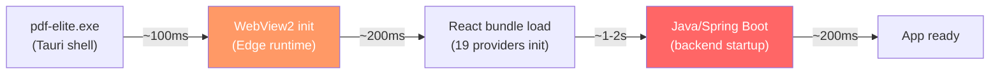
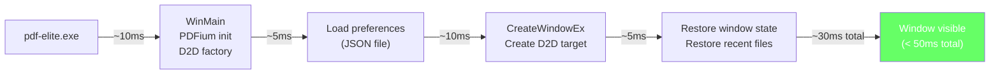

# Performance: Targets, Bottlenecks & Optimization

> **Document ID:** FILE-015 | **Status:** DRAFT | **Depends on:** RENDERING_ARCHITECTURE.md, THREADING.md, ARCHITECTURE.md

---

## Table of Contents

1. [Performance Targets](#1-performance-targets)
2. [Current Bottlenecks](#2-current-bottlenecks)
3. [Startup Optimization](#3-startup-optimization)
4. [Rendering Optimization](#4-rendering-optimization)
5. [Memory Management](#5-memory-management)
6. [Large Document Optimization](#6-large-document-optimization)
7. [Incremental Save](#7-incremental-save)
8. [Measurement & Profiling](#8-measurement--profiling)

---

## 1. Performance Targets

### 1.1 Target Table

| Metric | Target | Current (Tauri) | Measurement Point |
|--------|--------|-----------------|------------------|
| Cold start (no document) | < 500ms | 2-4s (Tauri + Java + WebView) | Process creation to window visible |
| Warm start (no document) | < 200ms | 1-2s | Window visible after cached DLLs loaded |
| Document open (100-page PDF) | < 300ms | 500ms-2s (depends on size) | File dialog close to first page on screen |
| Document open (1000-page PDF) | < 500ms | 2-5s | File dialog close to first page on screen |
| First page render (cold) | < 100ms | 100-300ms | Document loaded to pixels on screen |
| Scroll (tiles cached) | 60fps (16ms) | 30-60fps | Frame time during smooth scroll |
| Zoom (with scaling hint) | < 500ms to sharp | 300ms-1s | Zoom command to all visible tiles re-rendered |
| Thumbnail generation (per page) | < 50ms | 50-100ms | Worker thread time per 200px thumbnail |
| Full-text search (100 pages) | < 2s | 1-3s | Search submit to last result displayed |
| Memory baseline (no document) | < 50MB | 150-300MB | Process working set, empty state |
| Memory with 10-page document | < 100MB | 200-500MB | Working set with tiles cached |
| Memory with 100-page document | < 200MB | 500MB-1GB | Working set, visible tiles cached |
| Save (modified 10-page PDF) | < 1s | 500ms-2s | Save command to file written |
| Save (modified 100-page PDF) | < 3s | 2-5s | Save command to file written |

> **FACT:** The current app's cold start is 2-4 seconds due to: (1) Tauri WebView initialization (~500ms), (2) Java/Spring Boot startup (~1-2s), (3) JavaScript bundle loading (~200ms), (4) Pdfium WASM precompilation via `requestIdleCallback` (~500ms). A native C++ app eliminates all four of these.

### 1.2 Priority Matrix

| Metric | User Impact | Implementation Effort | Priority |
|--------|------------|---------------------|----------|
| Cold start | Critical (first impression) | Low (eliminate dependencies) | **P0** |
| Scroll smoothness | High (core interaction) | Medium (tile caching) | **P0** |
| Document open | High (every file) | Low (native file I/O) | **P0** |
| Memory baseline | High (perception of quality) | Medium (eliminate WebView/Java) | **P1** |
| Zoom responsiveness | Medium (frequent action) | Medium (scaling hint + re-render) | **P1** |
| Search speed | Medium (power users) | Low (native text extraction) | **P1** |
| Save speed | Low (infrequent) | Low (direct PDFium save) | **P2** |

---

## 2. Current Bottlenecks

### 2.1 Startup Chain



### 2.2 Runtime Bottlenecks

| Bottleneck | Cause | Impact | Eliminated By |
|-----------|-------|--------|--------------|
| Java startup | Spring Boot container, classpath scanning | 1-2s cold start | Remove Java entirely |
| WebView overhead | Edge WebView2 runtime, JS engine, GC | 100-150MB RAM baseline | Remove WebView, use Win32 + D2D |
| JSON roundtrip | Tauri invoke → Java → Tauri callback | 1-5ms per call | Direct C++ function calls |
| WASM bridge | postMessage to Web Worker for PDF ops | 0.1-1ms per call | Direct PDFium C API calls |
| React re-renders | State change → virtual DOM diff → DOM update | 5-16ms per meaningful update | Direct `InvalidateRect` (surgical) |
| Single WASM worker | Only one PDF operation at a time | Sequential tile renders | Worker pool (1-4 threads) |
| No render cancellation | Started tile renders complete even if scrolled away | Wasted CPU | Atomic cancellation flags |
| CSS filter for dark mode | `invert(1) hue-rotate(180deg)` on entire canvas | GPU compositing cost | D2D color matrix (per-tile, only when needed) |

---

## 3. Startup Optimization

### 3.1 Native Startup Sequence



### 3.2 Lazy Initialization

| Component | When Initialized | Reason |
|-----------|-----------------|--------|
| D2D render target | First `WM_SIZE` after `CreateWindowEx` | Need actual window dimensions |
| Render worker threads | First document opened | No work to do before then |
| Search thread | First Ctrl+F | Infrequent feature |
| PDFium FPDF_FORMHANDLE | First form field encountered | Overhead for non-form PDFs |
| Thumbnail cache | Left rail opened | Not needed if thumbnails not visible |
| Hotkey manager | After window created | Registered via `RegisterHotKey` or `WM_KEYDOWN` |

> **RECOMMENDATION:** Show the window as fast as possible (empty state or home page), then lazy-initialize subsystems. The user perceives instant launch even if internal setup takes an extra 50ms.

---

## 4. Rendering Optimization

### 4.1 Tile Rendering Optimizations

| Optimization | Impact | Implementation |
|-------------|--------|---------------|
| **Skip form rendering in tiles** | 20-40% faster per tile | Use `FPDF_RenderPageBitmap` (not `FPDF_FFLDraw`) for background tiles |
| **Skip annotation rendering in tiles** | 10-30% faster per tile | Render annotations separately as D2D overlays |
| **Cancel stale renders** | Save CPU on scroll/zoom | Atomic cancellation flags checked at render checkpoints |
| **Scale hint during zoom** | Instant visual feedback | Draw existing tiles scaled via D2D while re-rendering at new zoom |
| **Pre-render extra ring** | Zero-latency scroll for small movements | 1 extra ring of tiles around viewport (matching current `extraRings: 1`) |
| **DPI-aware rendering** | Sharp text on HiDPI | Render tiles at device pixel ratio, not logical pixels |

### 4.2 Compositing Optimizations

| Optimization | Impact | Implementation |
|-------------|--------|---------------|
| **Dirty rect painting** | Only repaint changed regions | Calculate dirty rect from scroll delta, use `InvalidateRect` with rect parameter |
| **Bitmap interpolation** | Smooth scaled tiles | `D2D1_BITMAP_INTERPOLATION_MODE_LINEAR` for scaled, `NEAREST_NEIGHBOR` for 1:1 |
| **Layered overlays** | Separate paint for each layer | Paint tiles → annotations → selection → redaction in sequence, each can be independently invalidated |
| **D2D hardware acceleration** | GPU-accelerated compositing | Default for `ID2D1HwndRenderTarget` on Windows 10+ |

### 4.3 Scroll Optimization

```cpp
// Fast scroll: blit existing pixels, only render newly-exposed region
void OnVScroll(int delta) {
    RECT clientRect;
    GetClientRect(hwndCanvas, &clientRect);

    // Scroll existing content
    ScrollWindowEx(hwndCanvas, 0, -delta, nullptr, nullptr, nullptr, nullptr,
                   SW_INVALIDATE | SW_ERASE);

    // Only the newly-exposed strip triggers WM_PAINT
    // If tiles are cached, WM_PAINT is a fast bitmap blit
}
```

> **FACT:** The current browser-based `overflow: auto` scroll does this automatically via the browser compositor. The native equivalent is `ScrollWindowEx` which blits the existing content and only invalidates the newly-exposed region.

---

## 5. Memory Management

### 5.1 Memory Budget

| Component | Budget | Notes |
|-----------|--------|-------|
| Process baseline (no docs) | < 50MB | EXE + DLLs + D2D + PDFium + heap overhead |
| Tile cache | 512MB (configurable) | 38 pages at 200% zoom (A4) |
| Thumbnail cache | 50MB | ~500 thumbnails at 200×280 pixels |
| Open document data | File size × 1 (original bytes) | Plus PDFium parse overhead (~2× file size) |
| Text cache | 10MB | Cached text extraction results |
| D2D render target | ~20MB | Back buffer for main window |
| **Total (typical 10-page doc)** | **~120MB** | Well within budget |
| **Total (100-page doc)** | **~200MB** | Within target |

### 5.2 Memory Optimization Strategies

| Strategy | Where Applied | Savings |
|----------|--------------|----------|
| **Lazy text extraction** | Per-page text only when searched/selected | Avoid holding all text in memory |
| **Memory-mapped file I/O** | Files > 100MB | Avoid double-copying file into `vector<uint8_t>` |
| **Tile cache eviction** | LRU with 80% high-water mark | Prevents unbounded growth |
| **Cold document state** | Inactive tabs evict tiles | Only active document keeps hot cache |
| **Thumbnail cache limit** | 10-document LRU (matching current) | Thumbnails are cheap to regenerate |
| **D2D bitmap sharing** | Shared pointers for immutable bitmaps | Avoid duplication across overlays |

### 5.3 Cold Tab State

> **FACT:** The current app keeps all open tabs fully in memory. With the Tauri WebView model, each tab's EmbedPDF instance retains its tile cache.

> **RECOMMENDATION:** In native, when a tab becomes inactive (user switches to another tab):
> 1. Evict ALL tiles from the tile cache for that document
> 2. Keep the `FPDF_DOCUMENT` handle open (fast to reload tiles)
> 3. Save scroll position and zoom in `PerDocumentState`
> 4. On tab reactivation, re-render visible tiles from cache miss
>
> This reduces memory usage for multi-tab users. Reactivation adds ~100-300ms (tile re-render) which is acceptable.

---

## 6. Large Document Optimization

### 6.1 Document Size Tiers

| Size | Pages | File Size | Strategy |
|------|-------|-----------|----------|
| Small | 1-50 | < 10MB | Load all, cache aggressively |
| Medium | 50-500 | 10-100MB | Normal tile caching, lazy text extraction |
| Large | 500-5000 | 100MB-1GB | Memory-mapped I/O, aggressive eviction, no thumbnails until viewed |
| Extreme | 5000+ | > 1GB | Memory-mapped I/O, single-ring rendering (no extra ring), minimal cache |

### 6.2 Extreme Document Handling

```cpp
void OnDocumentOpened(const Document& doc) {
    if (doc.pageCount > 5000 || doc.fileSize > 1024 * 1024 * 1024) {
        // Reduce tile cache for this document
        tileCache_.SetMaxBytes(128 * 1024 * 1024);  // 128MB instead of 512MB
        extraRings_ = 0;  // no pre-fetch ring
        thumbnailPreGeneration_ = false;  // generate on demand only
    }
}
```

### 6.3 Memory-Mapped I/O

```cpp
class MappedFileView {
    HANDLE file_ = INVALID_HANDLE_VALUE;
    HANDLE mapping_ = nullptr;
    void* data_ = nullptr;
    size_t size_ = 0;

public:
    MappedFileView(const std::wstring& path) {
        file_ = CreateFile(path.c_str(), GENERIC_READ, FILE_SHARE_READ,
                           nullptr, OPEN_EXISTING, FILE_FLAG_SEQUENTIAL_SCAN, nullptr);
        mapping_ = CreateFileMapping(file_, nullptr, PAGE_READONLY, 0, 0, nullptr);
        data_ = MapViewOfFile(mapping_, FILE_MAP_READ, 0, 0, 0);
        size_ = GetFileSize(file_, nullptr);
    }
    ~MappedFileView() {
        if (data_) UnmapViewOfFile(data_);
        if (mapping_) CloseHandle(mapping_);
        if (file_ != INVALID_HANDLE_VALUE) CloseHandle(file_);
    }
    void* Data() const { return data_; }
    size_t Size() const { return size_; }
};
```

> **RECOMMENDATION:** Use memory-mapped I/O for files > 100MB. For smaller files, reading into `vector<uint8_t>` is simpler and equally fast. PDFium's `FPDF_LoadMemDocument` works with both.

---

## 7. Incremental Save

### 7.1 Current Save Behavior

The current app uses EmbedPDF's `ExportPlugin` which serializes the entire document (including modifications) back to a byte array, then triggers a Tauri file save dialog via the Java backend.

### 7.2 Proposed Save Strategy

| Save Type | When | Method | Speed |
|-----------|------|--------|-------|
| **Quick save** | Ctrl+S, same file | `FPDF_SaveAsDocument` to original path | < 1s for 100 pages |
| **Save As** | Ctrl+Shift+S | `FPDF_SaveAsDocument` to new path | < 1s + file copy |
| **Incremental update** | Auto-save (if enabled) | `FPDF_SaveWithVersion` with incremental flag | < 200ms |
| **Optimized save** | File > Save Optimized | `FPDF_SaveAsDocument` + linearization | 2-5s (full rewrite) |

> **RECOMMENDATION:** Use PDFium's incremental save (`FPDF_SaveAsDocument` with the file opened for read-write) which appends changes to the end of the PDF rather than rewriting the entire file. This is dramatically faster for small modifications (e.g., adding one annotation to a 100MB PDF).

```cpp
bool SaveIncremental(Document& doc) {
    // Open file for read-write
    HANDLE hFile = CreateFile(doc.filePath.c_str(), GENERIC_READ | GENERIC_WRITE,
                               0, nullptr, OPEN_EXISTING, 0, nullptr);

    // PDFium incremental save
    FPDF_FILEWRITE write = {};
    write.version = 1;
    write.WriteBlock = [](void* ctx, const void* data, size_t size) -> int {
        HANDLE h = static_cast<HANDLE>(ctx);
        DWORD written;
        WriteFile(h, data, (DWORD)size, &written, nullptr);
        return 1;
    };

    // Truncate and rewrite
    SetFilePointer(hFile, 0, nullptr, FILE_BEGIN);
    SetEndOfFile(hFile);
    FPDF_SaveAsDocument(doc.handle, &write, 0, FPDF_SAVE_INCREMENTAL);
    CloseHandle(hFile);
    return true;
}
```

---

## 8. Measurement & Profiling

### 8.1 Instrumentation Points

| Point | Measurement | Tool |
|-------|------------|------|
| Process start | `GetTickCount64()` in `WinMain` vs window visible | Custom timer + logging |
| Document open | File dialog close to `WM_PAINT` with first tile | `QueryPerformanceCounter` |
| Tile render time | `FPDF_RenderPageBitmap` start/end | `QueryPerformanceCounter` in worker |
| Paint frame time | `BeginDraw` to `EndDraw` | `QueryPerformanceCounter` in `WM_PAINT` |
| Memory usage | `PROCESS_MEMORY_COUNTERS` via `GetProcessMemoryInfo` | Periodic sampling (1Hz) |
| Cache hit rate | Cache hits vs misses | Counter in `TileCache::Get` |
| Search time | Search submit to last result | `QueryPerformanceCounter` |

### 8.2 Debug Overlay

> **RECOMMENDATION:** Include a debug overlay (toggled with F12 or `--debug` flag) that shows:
> - FPS counter
> - Frame time (ms)
> - Tile cache hit rate (%)
> - Tile cache usage (MB / max MB)
> - Active worker threads
> - Pending render tasks
> - Current zoom level + pixels per point

```cpp
void DrawDebugOverlay(ID2D1RenderTarget* ctx) {
    if (!debugOverlayEnabled) return;
    // Draw semi-transparent background rect in top-right corner
    // Draw text: FPS, frame time, cache hit rate, memory usage
    // Updates every 500ms (not every frame, to avoid overhead)
}
```

### 8.3 Performance Regression Testing

| Test | Method | Pass Criteria |
|------|--------|--------------|
| Cold start | Automated: launch app, measure time to window visible | < 500ms |
| 100-page open | Automated: open test PDF, measure first-pixel time | < 300ms |
| Scroll benchmark | Automated: scroll 100 pages worth, measure min FPS | > 55fps average |
| Zoom benchmark | Automated: zoom 100% → 200% → 100%, measure time | < 1s total |
| Memory check | Automated: open 100-page PDF, check working set | < 200MB |

---

*End of FILE-015: PERFORMANCE.md*