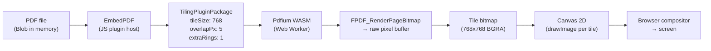
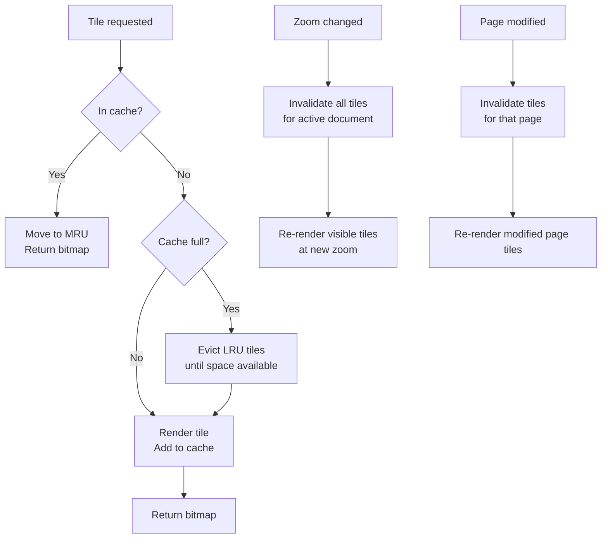
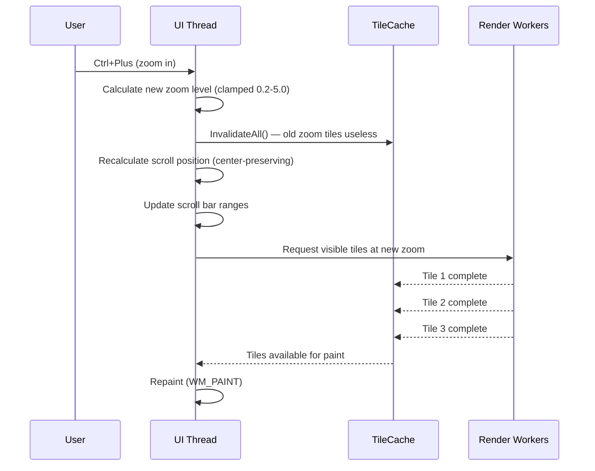
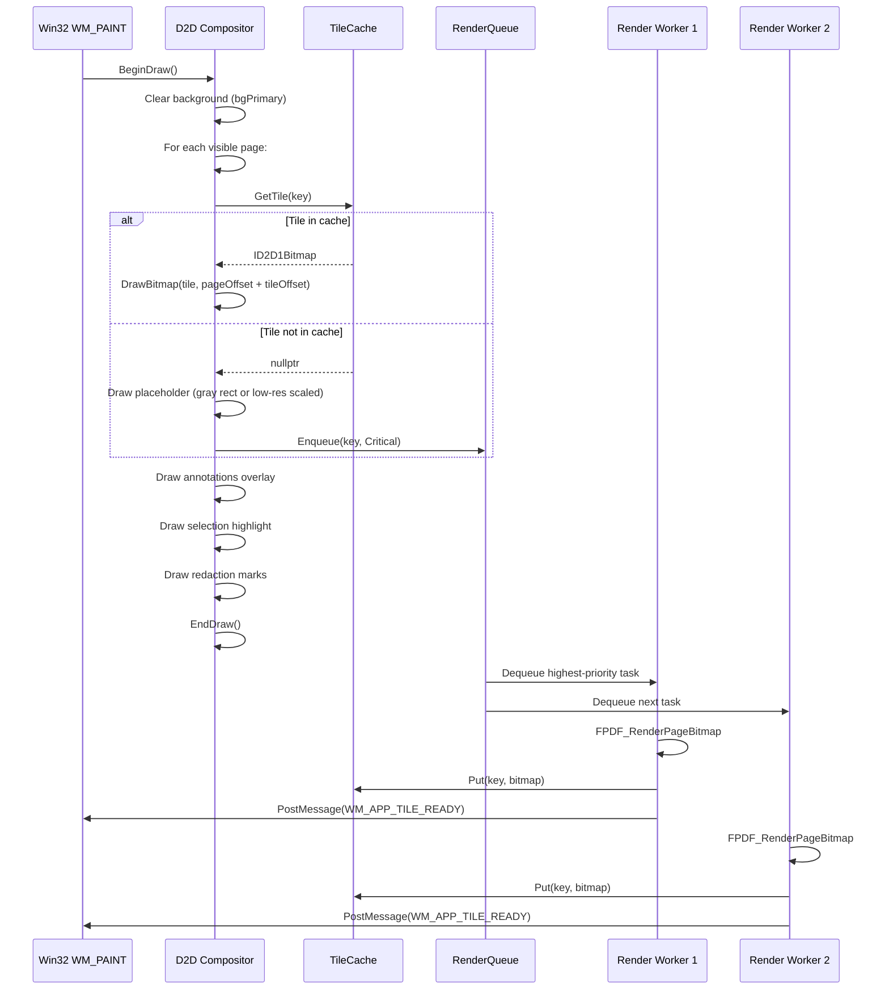

# Rendering Architecture: Tiles, Cache & Display Pipeline

> **Document ID:** FILE-013 | **Status:** DRAFT | **Depends on:** PDF_ENGINE.md, DATA_MODEL.md, UI_DESIGN.md

---

## Table of Contents

1. [Current Rendering Pipeline](#1-current-rendering-pipeline)
2. [Proposed Native Rendering Pipeline](#2-proposed-native-rendering-pipeline)
3. [Tile System Design](#3-tile-system-design)
4. [Tile Cache](#4-tile-cache)
5. [Zoom Strategy](#5-zoom-strategy)
6. [Scroll & Virtual Viewport](#6-scroll--virtual-viewport)
7. [Large Document Handling](#7-large-document-handling)
8. [Performance Targets](#8-performance-targets)
9. [Rendering Pipeline Diagram](#9-rendering-pipeline-diagram)

---

## 1. Current Rendering Pipeline

### 1.1 Data Flow



### 1.2 Current Tiling Parameters

> **FACT:** The `TilingPluginPackage` uses these exact parameters (from `src/plugins/tiling/TilingPluginPackage.ts`):

| Parameter | Value | Meaning |
|-----------|-------|----------|
| `tileSize` | 768px | Each tile is 768x768 pixels |
| `overlapPx` | 5px | Adjacent tiles overlap by 5px to prevent seam artifacts |
| `extraRings` | 1 | One extra ring of tiles beyond the visible viewport is pre-rendered |

### 1.3 Current Canvas Rendering

- **Canvas type:** HTML5 Canvas 2D (`<canvas>` element)
- **Rendering:** `ctx.drawImage(tile.bitmap, x, y, w, h)` per tile
- **Scroll owner:** Single `overflow: auto` on the `Viewport` div
- **PDF render mode:** CSS `filter` on canvas (`invert(1) hue-rotate(180deg)` for dark, `sepia(0.8)` for sepia)
- **Annotation rendering:** Separate canvas overlay or SVG on top of tile canvas
- **Text selection:** Highlight rectangles drawn on separate overlay

> **FACT:** The current app uses a single scroll owner (`overflow: auto` on Viewport). The viewport div's scroll position drives which tiles are visible. EmbedPDF's `ScrollPlugin` listens to scroll events and triggers tile requests for newly-visible regions.

---

## 2. Proposed Native Rendering Pipeline

### 2.1 Data Flow

```mermaid
flowchart LR
    PDF["PDF file<br/>(vector&lt;uint8_t&gt;)"] --> Fpdf["PDFium C API<br/>(native)"]
    Fpdf --> Render["FPDF_RenderPageBitmap<br/>→ FPDF_BITMAP"]
    Render --> D2D["CreateBitmapFromWicBitmap<br/>→ ID2D1Bitmap"]
    D2D --> Tile["Tile in cache<br/>(ID2D1Bitmap)"]
    Tile --> Compositor["D2D compositor<br/>(DrawBitmap per tile)"]
    Compositor --> Overlay["Annotation overlay<br/>(D2D shapes)"]
    Overlay --> Swap["DXGI swap chain<br/>→ screen"]
```



### 2.2 Key Differences

| Aspect | Current (WASM) | Proposed (Native) |
|--------|----------------|-------------------|
| PDFium execution | Web Worker (single thread) | Render worker pool (1-4 threads) |
| Bitmap format | Canvas `ImageData` (RGBA) | `FPDF_BITMAP` (BGRA) → `ID2D1Bitmap` |
| Compositing | Canvas 2D `drawImage` | D2D `DrawBitmap` with transform |
| Scroll | Browser `overflow: auto` | Custom `WS_VSCROLL` + `ScrollWindowEx` |
| Dark/Sepia mode | CSS `filter` on canvas | D2D color matrix effect |
| Tile storage | JS Map / object | C++ LRU cache with `ID2D1Bitmap` |
| GPU usage | Indirect (browser compositor) | Direct (D2D hardware acceleration) |
| Annotation rendering | Separate canvas / SVG | D2D shapes on same render target |

---

## 3. Tile System Design

### 3.1 Tile Coordinates

```cpp
struct TileKey {
    int pageIndex;
    int tileCol;
    int tileRow;
    double zoom;       // quantized to avoid cache thrashing

    bool operator==(const TileKey&) const = default;
};

// Hash function for unordered_map
struct TileKeyHash {
    size_t operator()(const TileKey& k) const {
        // Quantize zoom to nearest 0.01
        int zoomQ = (int)(k.zoom * 100 + 0.5);
        size_t h = std::hash<int>{}(k.pageIndex);
        h ^= std::hash<int>{}(k.tileCol) + 0x9e3779b9 + (h << 6) + (h >> 2);
        h ^= std::hash<int>{}(k.tileRow) + 0x9e3779b9 + (h << 6) + (h >> 2);
        h ^= std::hash<int>{}(zoomQ) + 0x9e3779b9 + (h << 6) + (h >> 2);
        return h;
    }
};
```

### 3.2 Tile Grid Calculation

For a given page at a given zoom level:

```
pagePixelWidth  = pageWidthPoints * zoom * (dpiScale / 72.0)
pagePixelHeight = pageHeightPoints * zoom * (dpiScale / 72.0)

tilesPerRow = ceil(pagePixelWidth / (TILE_SIZE - OVERLAP_PX))
tilesPerCol = ceil(pagePixelHeight / (TILE_SIZE - OVERLAP_PX))
```

> **CONSTANT:** `TILE_SIZE = 768`, `OVERLAP_PX = 5` (matching current behavior).

### 3.3 Tile Rendering Task

```cpp
struct RenderTask {
    TileKey key;
    std::atomic<bool> cancelled{false};

    // Output (set by worker when complete)
    std::shared_ptr<ID2D1Bitmap> bitmap;
    std::atomic<bool> complete{false};
};
```

### 3.4 Tile Render Process (Worker Thread)

```cpp
void RenderWorker::Execute(RenderTask& task) {
    auto& [pageIndex, col, row, zoom] = task.key;

    // 1. Acquire shared lock on document
    SharedDocumentLock lock(docId_);
    if (task.cancelled) return;

    // 2. Load page (transient)
    ScopedPage page(doc->handle, pageIndex);
    if (!page) return;

    // 3. Calculate source and destination rectangles
    int tilesX = (int)ceil(pageWidth / (TILE_SIZE - OVERLAP));
    int srcX = col * (TILE_SIZE - OVERLAP);
    int srcY = row * (TILE_SIZE - OVERLAP);
    int srcW = min(TILE_SIZE, (int)pageWidth - srcX);
    int srcH = min(TILE_SIZE, (int)pageHeight - srcY);

    // 4. Set up transform for zoom + offset
    FS_MATRIX matrix = { zoom, 0, 0, zoom, -srcX * zoom, -srcY * zoom };
    FPDF_Page_Render(page.Get(), &matrix, nullptr, &clip, FPDF_ANNOTATION);

    // 5. Render to bitmap
    ScopedBitmap bitmap(srcW, srcH);
    FPDF_RenderPageBitmap(bitmap.Get(), page.Get(), ...);

    if (task.cancelled) return;

    // 6. Convert to ID2D1Bitmap (must happen on UI thread for D2D)
    PostToUIThread([this, &task, bitmap = bitmap.Get(), srcW, srcH]() {
        // Create ID2D1Bitmap from pixel buffer
        D2D1_BITMAP_PROPERTIES props = {};
        props.pixelFormat = { DXGI_FORMAT_B8G8R8A8_UNORM, D2D1_ALPHA_MODE_PREMULTIPLIED };
        d2dTarget->CreateBitmap({srcW, srcH},
            FPDFBitmap_GetBuffer(bitmap), FPDFBitmap_GetStride(bitmap), &props, &task.bitmap);
        task.complete = true;
    });
}
```

> **RECOMMENDATION:** The `FPDF_RenderPageBitmap` call is the hot path. Ensure the PDFium form fill environment is NOT set during tile rendering (it adds overhead for form field rendering). Only enable form rendering for the final composite or when in form-fill mode.

---

## 4. Tile Cache

### 4.1 LRU Cache Design

```cpp
class TileCache {
    static constexpr size_t DEFAULT_MAX_BYTES = 512 * 1024 * 1024;  // 512 MB

    struct CacheEntry {
        std::shared_ptr<ID2D1Bitmap> bitmap;
        size_t byteSize;  // width * height * 4 (BGRA)
        std::list<TileKey>::iterator lruIterator;
    };

    std::unordered_map<TileKey, CacheEntry, TileKeyHash> cache_;
    std::list<TileKey> lruList_;  // front = most recently used
    size_t currentBytes_ = 0;
    size_t maxBytes_;
    SRWLOCK lock_ = SRWLOCK_INIT;

public:
    std::shared_ptr<ID2D1Bitmap> Get(const TileKey& key);
    void Put(const TileKey& key, std::shared_ptr<ID2D1Bitmap> bitmap, size_t byteSize);
    void InvalidatePage(int pageIndex);
    void InvalidateAll();
    void EvictToTarget(size_t targetBytes);  // background eviction

private:
    void EvictOne();  // evict least recently used
};
```

### 4.2 Cache Eviction Strategy



### 4.3 Memory Calculation

| Zoom Level | Typical Page (A4) | Tile Count | Memory per Page |
|------------|-------------------|------------|----------------|
| 1.0x (100%) | 595×842 px → 1 tile | 2 | 2 × 768² × 4 = 4.5 MB |
| 1.5x (150%) | 893×1263 px → 4 tiles | 4 | 4 × 768² × 4 = 9.0 MB |
| 2.0x (200%) | 1191×1684 px → 6 tiles | 6 | 6 × 768² × 4 = 13.5 MB |
| 3.0x (300%) | 1786×2526 px → 12 tiles | 12 | 12 × 768² × 4 = 27 MB |

> **FACT:** At 200% zoom, a single A4 page requires ~13.5 MB of tile cache. With 512 MB cache, approximately 38 pages can be cached simultaneously. With the extra ring pre-rendering, scrolling through a 100-page document will cause cache pressure but remains within budget for the visible + adjacent pages.

### 4.4 Background Eviction

> **RECOMMENDATION:** Run a low-priority background task every 2 seconds that evicts tiles until cache usage is below 80% of the limit. This prevents sudden eviction spikes during scroll.

```cpp
void TileCache::BackgroundEvict() {
    size_t targetBytes = (size_t)(maxBytes_ * 0.8);
    EvictToTarget(targetBytes);
}
```

---

## 5. Zoom Strategy

### 5.1 Zoom Handling Flow



### 5.2 Zoom Levels

| Mode | Behavior |
|------|----------|
| **FitWidth** | `zoom = canvasWidth / (pageWidthPoints * dpiScale / 72)` — recalculates on resize |
| **FitPage** | `zoom = min(canvasWidth/pageW, canvasHeight/pageH)` — recalculates on resize |
| **Percentage** | Fixed zoom (0.2x to 5.0x). User selects or uses Ctrl+/- |
| **Ctrl+Scroll** | Incremental zoom centered on cursor position |

### 5.3 Zoom During Scroll (Ctrl+MouseWheel)

```cpp
void OnCtrlMouseWheel(int delta, int cursorX, int cursorY) {
    double oldZoom = viewSettings.zoomLevel;
    double newZoom = ClampZoom(oldZoom * (delta > 0 ? 1.1 : 1.0 / 1.1));

    // Preserve point under cursor
    double factor = newZoom / oldZoom;
    int newScrollX = (int)(cursorX + (scrollX - cursorX) * factor);
    int newScrollY = (int)(cursorY + (scrollY - cursorY) * factor);

    SetZoom(newZoom, newScrollX, newScrollY);
}
```

### 5.4 Cache Hint for Zoom

> **RECOMMENDATION:** When zooming in a single step (e.g., 100% → 125%), do NOT invalidate the entire cache immediately. Instead:
> 1. Scale existing tiles using D2D `DrawBitmap` with a transform (fast, slightly blurry)
> 2. Kick off re-rendering at the new zoom in priority order
> 3. Replace scaled tiles with sharp tiles as they complete
>
> This provides instant visual feedback and eliminates the "blank flash" during zoom.

---

## 6. Scroll & Virtual Viewport

### 6.1 Virtual Document Size

```cpp
SIZE CalculateVirtualSize() {
    SIZE size = {0, 0};
    int gap = 8;  // pixels between pages

    for (int i = 0; i < doc->pageCount; i++) {
        PageInfo info = GetPageInfo(i);
        double pw = info.width * viewSettings.pixelsPerPoint;
        double ph = info.height * viewSettings.pixelsPerPoint;
        size.cx = max(size.cx, (LONG)ceil(pw));
        size.cy += (LONG)ceil(ph);
        if (i > 0) size.cy += gap;
    }
    size.cx += 2 * PAGE_MARGIN_X;
    size.cy += 2 * PAGE_MARGIN_Y;
    return size;
}
```

### 6.2 Scroll Implementation

```cpp
void OnVScroll(int scrollCode, int newPos) {
    SCROLLINFO si = { sizeof(SCROLLINFO), SIF_ALL };
    GetScrollInfo(hwndCanvas, SB_VERT, &si);

    switch (scrollCode) {
        case SB_LINEUP:    si.nPos -= 40; break;
        case SB_LINEDOWN:  si.nPos += 40; break;
        case SB_PAGEUP:    si.nPos -= si.nPage; break;
        case SB_PAGEDOWN:  si.nPos += si.nPage; break;
        case SB_THUMBTRACK: si.nPos = newPos; break;
    }

    si.nPos = max(0, min(si.nPos, si.nMax - (int)si.nPage + 1));
    SetScrollInfo(hwndCanvas, SB_VERT, &si, TRUE);
    ScrollWindowEx(hwndCanvas, 0, oldPos - si.nPos, ...);
    UpdateVisibleTiles();
}
```

### 6.3 Visible Tile Calculation

```cpp
std::vector<TileKey> GetVisibleTileKeys() {
    std::vector<TileKey> keys;
    RECT visible = GetVisibleRect();  // from scroll position + window size

    for (int page = 0; page < doc->pageCount; page++) {
        RECT pageRect = GetPageScreenRect(page);
        if (!IntersectRect(&intersect, &visible, &pageRect)) continue;

        // Calculate which tiles cover the visible portion of this page
        int colStart = max(0, (intersect.left - pageRect.left) / (TILE_SIZE - OVERLAP));
        int colEnd = min(tilesX-1, (intersect.right - pageRect.left) / (TILE_SIZE - OVERLAP));
        int rowStart = max(0, (intersect.top - pageRect.top) / (TILE_SIZE - OVERLAP));
        int rowEnd = min(tilesY-1, (intersect.bottom - pageRect.top) / (TILE_SIZE - OVERLAP));

        for (int r = rowStart; r <= rowEnd; r++)
            for (int c = colStart; c <= colEnd; c++)
                keys.push_back({page, c, r, viewSettings.zoomLevel});
    }
    return keys;
}

// Include extra ring
void UpdateVisibleTiles() {
    auto keys = GetVisibleTileKeys();
    auto expanded = ExpandWithExtraRing(keys, 1);  // extraRings = 1
    for (auto& key : expanded) {
        if (!tileCache_.Get(key)) {
            renderQueue_.Enqueue(key, Priority::Normal);
        }
    }
}
```

---

## 7. Large Document Handling

### 7.1 Lazy Page Loading

> **FACT:** The current EmbedPDF loads the full PDF into memory (WASM heap) and parses all pages on open. For a 500-page document, this can take several seconds.

> **RECOMMENDATION:** In native PDFium, `FPDF_LoadMemDocument` parses the cross-reference table and page tree but does NOT parse individual page content. Page content is parsed lazily on `FPDF_LoadPage`. This means opening a 10,000-page PDF is fast — only the xref is read. Tiles are rendered on demand.

### 7.2 Tile Eviction for Large Documents

| Scenario | Strategy |
|----------|----------|
| 100-page document | Cache all visible + 1 extra ring. 512MB handles 38 pages at 200%. |
| 1000-page document | Same strategy. Only ~5-10 pages visible. Cache pressure low. |
| 10000-page document | Same strategy. Page info loaded lazily. Tile cache naturally limits to visible pages. |

### 7.3 Memory-Mapped I/O for File Loading

> **RECOMMENDATION:** For files > 100MB, use `CreateFileMapping` + `MapViewOfFile` instead of reading the entire file into a `vector<uint8_t>`. PDFium can work with mapped memory.

```cpp
std::variant<std::vector<uint8_t>, MappedFileView> LoadFile(const std::wstring& path) {
    uint64_t size = GetFileSize(path);
    if (size > 100 * 1024 * 1024) {
        return MappedFileView(path);  // memory-mapped
    }
    return ReadFileToVector(path);    // in-memory buffer
}
```

---

## 8. Performance Targets

| Metric | Target | Measurement Method |
|--------|--------|--------------------|
| First page render (cold) | < 100ms | From `FPDF_LoadMemDocument` return to first tile on screen |
| Subsequent page render (warm cache) | < 16ms | Tile bitmap already in cache, just D2D `DrawBitmap` |
| Scroll (tile-stable) | 60fps (16ms/frame) | All visible tiles cached, just compositor redraw |
| Zoom (with scaling hint) | < 500ms | From zoom command to all visible tiles at new zoom rendered |
| Zoom (cache hit) | < 16ms | Tiles already at target zoom in cache |
| Tile render (single 768×768) | < 30ms | Worker thread, typical A4 page at 100% zoom |
| Thumbnail generation | < 50ms per page | Worker thread, 200px wide thumbnail |
| Text search (100 pages) | < 2s | Full-text search across 100-page document |

### 8.1 Render Priority

| Priority | Use Case | Reason |
|----------|-----------|--------|
| Critical (0) | Currently visible tiles, no cached version | User is staring at blank space |
| High (1) | Visible tiles that need re-render (zoom change) | Blurry scaled version showing, needs sharp replacement |
| Normal (2) | Extra ring tiles (pre-fetch) | Will be visible during scroll |
| Low (3) | Thumbnails not yet visible | Background generation |
| Background (4) | Non-visible page thumbnails | Pre-warming thumbnail cache |

---

## 9. Rendering Pipeline Diagram

### 9.1 Complete Paint Cycle



### 9.2 D2D Render Target Setup

```cpp
void CreateD2DTarget(HWND hwnd) {
    auto factory = GetD2DFactory();
    D2D1_RENDER_TARGET_PROPERTIES props = D2D1::RenderTargetProperties(
        D2D1_RENDER_TARGET_TYPE_DEFAULT,
        D2D1::PixelFormat(DXGI_FORMAT_B8G8R8A8_UNORM, D2D1_ALPHA_MODE_PREMULTIPLIED)
    );
    D2D1_HWND_RENDER_TARGET_PROPERTIES hwndProps = D2D1::HwndRenderTargetProperties(
        hwnd, D2D1::SizeU(width, height)
    );
    factory->CreateHwndRenderTarget(&props, &hwndProps, &d2dTarget_);
}
```

### 9.3 Paint Handler

```cpp
void OnPaint() {
    d2dTarget_->BeginDraw();
    d2dTarget_->Clear(theme->bgPrimary);

    auto visibleKeys = GetVisibleTileKeys();
    for (auto& key : visibleKeys) {
        auto tile = tileCache_.Get(key);
        if (tile) {
            auto dest = GetTileScreenRect(key);
            auto source = D2D1::RectF(0, 0,
                (float)tile->GetPixelSize().width,
                (float)tile->GetPixelSize().height);
            d2dTarget_->DrawBitmap(tile.get(), dest, 1.0f,
                D2D1_BITMAP_INTERPOLATION_MODE_LINEAR, source);
        } else {
            // Draw placeholder
            auto dest = GetTileScreenRect(key);
            d2dTarget_->FillRectangle(dest, theme->bgSecondary);
        }
    }

    DrawAnnotations();
    DrawSelections();
    DrawRedactionMarks();

    HRESULT hr = d2dTarget_->EndDraw();
    if (hr == D2DERR_RECREATE_TARGET) {
        RecreateD2DTarget();
    }
}
```

---

*End of FILE-013: RENDERING_ARCHITECTURE.md*