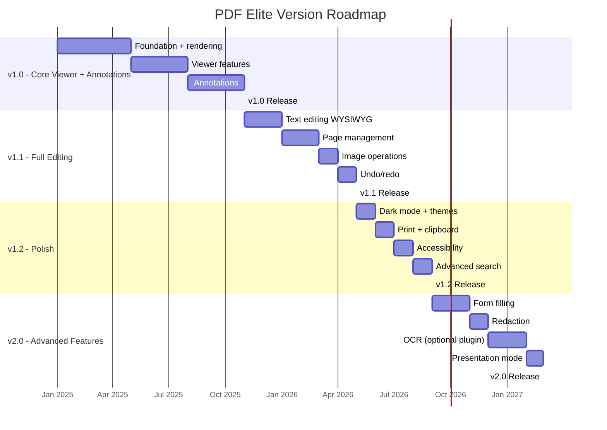

# Product Roadmap

> **FACT:** The current PDF Elite has ~60 features from Stirling PDF, trimmed to 17 active features.
> **RECOMMENDATION:** Ship a focused v1.0 that handles 90% of daily PDF tasks, then iterate.
> **ASSUMPTION:** Development team of 2-3 experienced C++/Win32 developers.

---

## Version Timeline

---

## v1.0 — Core Viewer with Annotation Support

**Target Date:** Month 10 (Q3 2025)
**Theme:** "Open, view, annotate, save — fast and reliable"

### Must-Have Features

| Feature | Priority | Description |
|---------|----------|-------------|
| PDF open/render/save | P0 | Core viewing loop |
| Tile-based rendering | P0 | Smooth zoom and scroll |
| Multi-tab | P0 | Multiple documents open |
| Text selection + copy | P0 | Select and copy text |
| Search (find) | P0 | Find text across document |
| Zoom (25%–6400%) | P0 | All standard zoom levels |
| Page navigation | P0 | First/prev/next/last/goto |
| Keyboard shortcuts | P0 | 20+ standard shortcuts |
| Annotations: Highlight | P0 | Text highlight |
| Annotations: Underline/Strikethrough/Squiggly | P0 | Text markup |
| Annotations: Free text | P0 | Typewriter annotation |
| Annotations: Sticky note | P0 | Comment annotation |
| Annotations: Ink (freehand) | P1 | Drawing annotations |
| Annotations: Shapes (line/rect/ellipse/arrow) | P1 | Shape annotations |
| Annotations: Stamp | P2 | Predefined stamps |
| Thumbnail sidebar | P1 | Page thumbnail navigation |
| Bookmark sidebar | P1 | Document outline navigation |
| Recent files | P1 | MRU list in File menu |
| Settings (JSON) | P1 | Basic preferences |

### Success Criteria

- [ ] Opens any PDF that Adobe Acrobat can open
- [ ] 500-page document scrolls at 60fps
- [ ] Text selection works on English, CJK, and mixed documents
- [ ] All 12 annotation types can be created, modified, and deleted
- [ ] Annotations persist correctly through save/reload cycle
- [ ] Application starts in < 1 second
- [ ] Installer size < 50MB
- [ ] Zero crashes on PDF 2.0 test suite (first 100 documents)

---

## v1.1 — Full Editing

**Target Date:** Month 14 (Q4 2025)
**Theme:** "Edit text, manage pages, manipulate images"

### Must-Have Features

| Feature | Priority | Description |
|---------|----------|-------------|
| Text editing (WYSIWYG) | P0 | In-place text modification |
| Find and replace | P0 | Search and replace text |
| Page rotate | P0 | Rotate pages 90°/180°/270° |
| Page delete | P0 | Remove pages |
| Page insert (blank) | P0 | Add blank pages |
| Page insert (from file) | P0 | Insert pages from another PDF |
| Page extract | P0 | Save page range as new PDF |
| Page reorder | P0 | Drag-drop page reordering |
| Page merge | P0 | Combine multiple PDFs |
| Page split | P1 | Split into separate files |
| Extract images | P1 | Extract embedded images |
| Add images | P1 | Insert images into PDF |
| Remove images | P1 | Remove selected/all images |
| Replace images | P2 | Replace embedded images |
| Undo/redo | P0 | Full document undo/redo stack |
| Page numbers | P2 | Add page numbers to document |
| Auto-rotate | P2 | Auto-rotate based on content |
| Attachment sidebar | P2 | View/extract embedded files |
| PDF info | P2 | View and edit document metadata |

### Success Criteria

- [ ] Text editing preserves font style and size
- [ ] All page operations support undo/redo
- [ ] Page merge combines documents without quality loss
- [ ] 100 consecutive edits + undo all = original document
- [ ] Image extraction handles all common formats (JPEG, PNG, JBIG2, CCITT)
- [ ] No document corruption after any editing operation

---

## v1.2 — Polish

**Target Date:** Month 18 (Q2 2026)
**Theme:** "Professional, accessible, delightful"

### Must-Have Features

| Feature | Priority | Description |
|---------|----------|-------------|
| Dark mode | P0 | Full dark theme |
| System theme detection | P0 | Follow Windows light/dark setting |
| Native print | P0 | Print dialog with page range, copies |
| Print preview | P1 | Preview before printing |
| Clipboard operations | P0 | Copy/paste text and images |
| Drag-drop files | P0 | Drop PDFs to open |
| Drag-drop pages | P1 | Drag pages between documents |
| File associations | P0 | Default PDF handler option |
| Accessibility: keyboard nav | P0 | Full keyboard navigation |
| Accessibility: screen reader | P1 | MSAA/UIA support |
| Advanced search | P1 | Regex, case, whole word, wildcards |
| Comment/reply system | P2 | Annotation comments and replies |
| Presentation mode | P2 | Full-screen slideshow |
| Hyperlink editing | P2 | Add/edit/remove hyperlinks |
| Headers/footers | P2 | Add headers and footers |
| Watermarks | P2 | Add text/image watermarks |
| Custom page colors | P3 | Background color for viewing |

### Success Criteria

- [ ] Dark mode applies to 100% of UI elements
- [ ] Printing at 300 DPI matches screen rendering
- [ ] NVDA/JAWS can navigate the document
- [ ] File association works immediately after install
- [ ] Drag-drop from Explorer opens PDFs
- [ ] Application passes Windows Application Certification

---

## v2.0 — Advanced Features

**Target Date:** Month 24 (Q4 2026)
**Theme:** "Professional PDF power tools"

### Features

| Feature | Priority | Description |
|---------|----------|-------------|
| Form filling | P0 | Fill interactive form fields |
| Form creation | P1 | Create new form fields |
| Redaction | P0 | Permanently remove sensitive content |
| OCR (optional) | P2 | Tesseract-based, optional plugin |
| Digital signatures | P1 | Sign and verify documents |
| Spell check | P2 | Check spelling in free text annotations |
| Reading history | P2 | Track reading position across sessions |
| Measurement tools | P2 | Distance, area measurement |
| Comparison | P3 | Side-by-side document comparison |
| Batch operations | P3 | Apply operations to multiple files |

### Success Criteria

- [ ] All AcroForm field types work (text, checkbox, radio, dropdown, button, signature)
- [ ] Redaction permanently removes content (verified with binary inspection)
- [ ] OCR produces searchable text layer on scanned documents
- [ ] Digital signatures validate against trusted roots

---

## Beyond v2.0

| Version | Theme | Key Features |
|---------|-------|-------------|
| v2.1 | Cloud Integration | Optional cloud storage, WebDAV support |
| v2.2 | Collaboration | Shared annotations, real-time co-editing |
| v3.0 | Cross-Platform | macOS port (AppKit + PDFium), Linux (GTK + PDFium) |
| v3.1 | AI-Assisted | Smart form filling, auto-tagging, layout analysis |

> **RECOMMENDATION:** Do not begin cross-platform or cloud work until the Windows v2.0 is stable and shipping.

---

## Milestone Definitions

| Milestone | Definition | Gate Criteria |
|-----------|-----------|--------------|
| Alpha | Internal testing build | All planned features implemented, known bugs tracked |
| Beta | External testing build | No P0 bugs, < 10 P1 bugs, crash-free for 1 hour |
| Release Candidate | Final testing build | No P0/P1 bugs, all tests passing, localization complete |
| GA (General Availability) | Public release | Code signed, installer tested on 5 Windows versions, docs complete |
| LTS | Long-term support release | 12 months of bug fixes, security patches only |

---

## Release Cadence

| Type | Frequency | Examples |
|------|-----------|----------|
| Major release | Every 6–8 months | v1.0, v1.1, v2.0 |
| Minor release | Every 2–3 months | v1.0.1, v1.1.2 |
| Patch release | As needed | v1.0.1 (hotfix), v1.0.2 (security) |

> **RECOMMENDATION:** Adopt semantic versioning (MAJOR.MINOR.PATCH) from day one.
