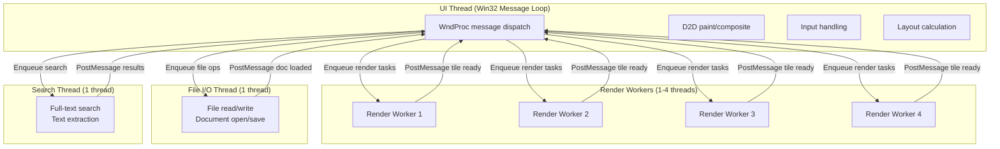
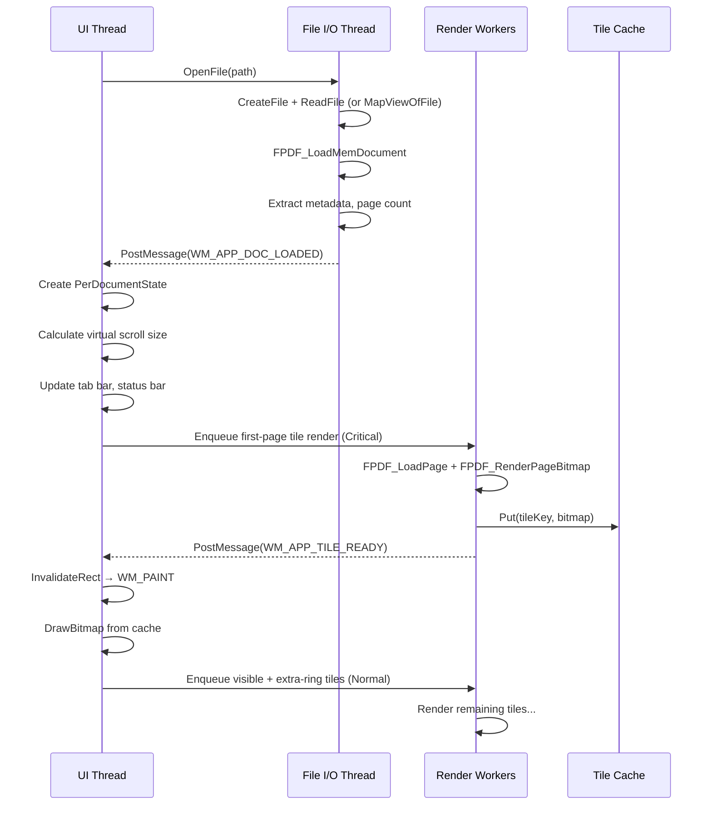
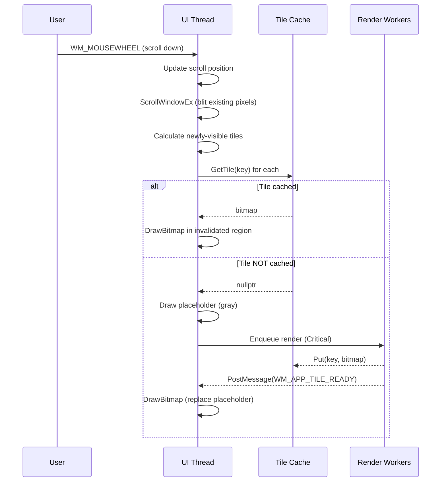

# Threading Model: Worker Threads & Synchronization

> **Document ID:** FILE-014 | **Status:** DRAFT | **Depends on:** RENDERING_ARCHITECTURE.md, DATA_MODEL.md

---

## Table of Contents

1. [Current Threading Model](#1-current-threading-model)
2. [Proposed Threading Architecture](#2-proposed-threading-architecture)
3. [Thread Responsibilities](#3-thread-responsibilities)
4. [Synchronization Primitives](#4-synchronization-primitives)
5. [Task Queue with Priority](#5-task-queue-with-priority)
6. [Cancellation via Atomics](#6-cancellation-via-atomics)
7. [PDFium Isolation](#7-pdfium-isolation)
8. [Threading Diagram](#8-threading-diagram)

---

## 1. Current Threading Model

### 1.1 Threads in the Current App

| Thread | Technology | Responsibilities | Communication Method |
|--------|-----------|----------------|-------------------|
| Main/UI | Browser main thread (WebView) | React rendering, DOM updates, event handling | Direct function calls, React state updates |
| Pdfium WASM | Web Worker | PDF parsing, page rendering, text extraction | `postMessage` (structured clone) |
| Java backend | Java virtual threads (Spring Boot) | File operations, server sync, batch processing | HTTP REST / WebSocket via Tauri bridge |
| Thumbnail | Separate Web Worker (or shared) | Thumbnail generation via Pdfium WASM | `postMessage` |
| Search | Potentially shared with main WASM worker | Full-text search via PDFium | `postMessage` with 300ms debounce |

> **FACT:** The current app has a fundamental bottleneck: every high-frequency update (scroll position, cursor, zoom) must cross the WebView → WASM bridge via `postMessage`. The `ViewerBridgeRegistry` was created specifically to bypass this by directly mutating DOM elements for scroll/zoom, avoiding the React state update cycle.

### 1.2 Problems with Current Model

1. **Single WASM worker** — only one PDF operation at a time (render OR search OR text extract)
2. **Java startup overhead** — Spring Boot adds seconds to cold start
3. **JSON serialization** — data crosses WebView ↔ Java boundary as JSON strings
4. **No true parallelism** — WebView is single-threaded for DOM access
5. **Bridge latency** — even `postMessage` to a Web Worker adds ~0.1-1ms per call

---

## 2. Proposed Threading Architecture

### 2.1 Thread Pool Design



### 2.2 Thread Count Rationale

| Thread Type | Count | Rationale |
|-------------|-------|----------|
| UI thread | 1 | Win32 requirement — all window messages on one thread |
| Render workers | `min(hardwareConcurrency - 2, 4)` | Subtract UI + I/O threads. Cap at 4 (diminishing returns for PDF rendering) |
| File I/O | 1 | Sequential file operations. One thread prevents disk contention |
| Search | 1 | Search is CPU-bound (text extraction) but runs infrequently |

> **RECOMMENDATION:** Default to 2 render workers on dual-core, 4 on quad-core+. Allow user to configure via preferences (`renderWorkerCount`). Some PDFs with complex vector graphics benefit from parallelism; simple text PDFs do not.

---

## 3. Thread Responsibilities

### 3.1 UI Thread (Main Thread)

**Owns:** All Win32 windows, D2D render targets, `AppState`, UI event handlers.

| Operation | Can Do | Cannot Do |
|-----------|--------|----------|
| Handle WM_PAINT | Yes | — |
| Handle input (mouse, keyboard) | Yes | — |
| Modify `AppState` | Yes | — |
| Call D2D drawing functions | Yes | — |
| Call PDFium API | **No** (slow, blocks UI) | — |
| Access tile cache bitmaps | Read only (for drawing) | Write |
| Modify document structure | Only via command dispatch | Direct PDFium manipulation |

### 3.2 Render Workers

**Owns:** Transient `FPDF_PAGE` and `FPDF_BITMAP` handles during render.

| Operation | Can Do | Cannot Do |
|-----------|--------|----------|
| `FPDF_LoadPage` | Yes (with shared lock) | — |
| `FPDF_RenderPageBitmap` | Yes | — |
| `FPDFText_LoadTextPage` | Yes | — |
| `FPDFText_GetText` | Yes | — |
| Access UI thread data | Read only (immutable) | Write |
| Post results to UI | Via `PostMessage` | Direct call |
| Call D2D functions | **No** (D2D is not thread-safe) | — |

### 3.3 File I/O Thread

**Owns:** File handles during read/write.

| Operation | Can Do | Cannot Do |
|-----------|--------|----------|
| `CreateFile` / `ReadFile` | Yes | — |
| `WriteFile` (save PDF) | Yes | — |
| `FPDF_LoadMemDocument` | Yes (after file read) | — |
| `FPDF_SaveAsDocument` | Yes | — |
| Memory-mapped file I/O | Yes | — |

### 3.4 Search Thread

**Owns:** Transient text extraction state.

| Operation | Can Do | Cannot Do |
|-----------|--------|----------|
| `FPDFText_LoadTextPage` | Yes (with shared lock) | — |
| `FPDFText_GetText` | Yes | — |
| String matching | Yes | — |
| Post results to UI | Via `PostMessage` | Direct call |

---

## 4. Synchronization Primitives

### 4.1 Primitive Selection

| Primitive | Win32 API | Use Case |
|-----------|-----------|----------|
| `SRWLOCK` | `AcquireSRWLockShared/Exclusive` | Per-document PDFium access (readers-writer) |
| `std::atomic<bool>` | C++ standard | Cancellation flags, task completion flags |
| `std::atomic<int>` | C++ standard | Reference counting, pending task count |
| `CONDITION_VARIABLE` | `WakeConditionVariable` | Task queue wait/wake for workers |
| `CRITICAL_SECTION` | `EnterCriticalSection` | Tile cache access (brief, frequent) |
| `PostMessage` | Win32 API | Cross-thread communication to UI thread |

> **FACT:** `SRWLOCK` is preferred over `CRITICAL_SECTION` for PDFium document access because renders can proceed in parallel (shared/reader lock) while structural changes (add/delete page, apply redaction) require exclusive access.

### 4.2 Lock Hierarchy (to prevent deadlock)

1. **Global task queue lock** (shortest hold time)
2. **Tile cache lock** (`CRITICAL_SECTION`)
3. **Per-document PDFium lock** (`SRWLOCK`)
4. **No other locks** — UI state is only accessed on UI thread

> **RECOMMENDATION:** Never acquire lock 3 while holding lock 2, and never acquire lock 2 while holding lock 1. Always release in reverse order. If a render worker needs to put a tile in the cache, it should: (a) render the bitmap, (b) release PDFium lock, (c) acquire cache lock, (d) insert tile, (e) release cache lock, (f) post to UI thread.

---

## 5. Task Queue with Priority

### 5.1 Priority Queue Design

```cpp
enum class TaskPriority : int {
    Critical = 0,   // visible tile, no cached version
    High = 1,       // visible tile, needs re-render (zoom)
    Normal = 2,     // extra ring pre-fetch
    Low = 3,        // thumbnail generation
    Background = 4  // non-visible thumbnail pre-warm
};

struct Task {
    std::function<void()> execute;
    TaskPriority priority;
    uint64_t sequenceNumber;  // for FIFO within same priority
    std::atomic<bool>* cancellationFlag = nullptr;
};

class PriorityTaskQueue {
    std::vector<std::queue<Task>> queues_{5};  // one per priority level
    CONDITION_VARIABLE cv_;
    SRWLOCK lock_ = SRWLOCK_INIT;
    std::atomic<bool> shutdown_{false};

public:
    void Enqueue(Task&& task);
    Task Dequeue();  // blocks until task available or shutdown
    void Shutdown();
    void CancelAll();  // set all pending cancellation flags
};
```

### 5.2 Worker Thread Loop

```cpp
void RenderWorker::Run() {
    while (true) {
        Task task = taskQueue_.Dequeue();  // blocks if empty
        if (task.cancellationFlag && task.cancellationFlag->load()) continue;
        task.execute();
    }
}
```

---

## 6. Cancellation via Atomics

### 6.1 Cancellation Strategy

> **FACT:** The current WASM-based rendering has no cancellation. Once a tile render starts in the Web Worker, it runs to completion even if the user has scrolled away. This wastes CPU cycles.

```cpp
struct RenderTask {
    TileKey key;
    std::atomic<bool> cancelled{false};
    // ...
};

// When zoom changes:
void OnZoomChanged(double newZoom) {
    // Cancel all pending render tasks
    for (auto& [key, task] : pendingTasks_) {
        task.cancelled.store(true);
    }
    pendingTasks_.clear();

    // Invalidate cache
    tileCache_.InvalidateAll();

    // Request new tiles
    RequestVisibleTiles();
}

// When scrolling:
void OnScroll() {
    // Do NOT cancel pending tiles — they might still be in the extra ring
    // Just request any newly-visible tiles
    RequestVisibleTiles();
}
```

### 6.2 Cancellation Checkpoints

A render worker checks cancellation at these points:

1. Before `FPDF_LoadPage` (cheap, avoids page parse)
2. Before `FPDF_RenderPageBitmap` (expensive, avoids render)
3. After `FPDF_RenderPageBitmap` (before posting result — if cancelled, discard bitmap)

```cpp
void RenderTile(RenderTask& task) {
    if (task.cancelled.load(std::memory_order_relaxed)) return;  // Check 1

    ScopedPage page(doc, task.key.pageIndex);
    if (!page || task.cancelled.load(std::memory_order_relaxed)) return;

    ScopedBitmap bitmap(width, height);
    FPDF_RenderPageBitmap(bitmap.Get(), page.Get(), ...);

    if (task.cancelled.load(std::memory_order_relaxed)) return;  // Check 3

    // Convert to D2D bitmap and post to UI
    PostTileReady(task.key, bitmap.Get());
}
```

---

## 7. PDFium Isolation

### 7.1 Per-Document Isolation

> **FACT:** PDFium is NOT thread-safe for the same `FPDF_DOCUMENT` handle when using the form fill environment. Without form fill, multiple threads can read the same document concurrently (each with their own `FPDF_PAGE`).

**Strategy:**

| Scenario | Isolation | Locking |
|----------|-----------|---------|
| Rendering (no form fill) | Shared `FPDF_DOCUMENT`, per-thread `FPDF_PAGE` | Shared lock (SRWLOCK reader) |
| Text extraction | Shared `FPDF_DOCUMENT`, per-thread `FPDF_TEXTPAGE` | Shared lock (SRWLOCK reader) |
| Form fill interaction | Exclusive access to `FPDF_DOCUMENT` | Exclusive lock (SRWLOCK writer) |
| Save / export | Exclusive access | Exclusive lock (SRWLOCK writer) |
| Page add/delete/redaction | Exclusive access | Exclusive lock (SRWLOCK writer) |

### 7.2 FPDF_FORMHANDLE Considerations

> **RECOMMENDATION:** Do NOT pass `FPDF_FORMHANDLE` to `FPDF_RenderPageBitmap` during tile rendering. Form field rendering adds significant overhead and is not needed for background tiles. Only render form fields when the user is in form-fill mode and viewing the affected page. This avoids needing exclusive access during most renders.

```cpp
// Fast tile render (no form fields):
FPDF_RenderPageBitmap(bitmap, page, start_x, start_y, size_x, size_y, rotate, flags);

// Full render with form fields (UI thread only, for active page):
FPDF_FFLDraw(formHandle, bitmap, page, start_x, start_y, size_x, size_y, rotate, flags);
```

---

## 8. Threading Diagram

### 8.1 Document Open Sequence



### 8.2 Scroll Sequence



---

*End of FILE-014: THREADING.md*