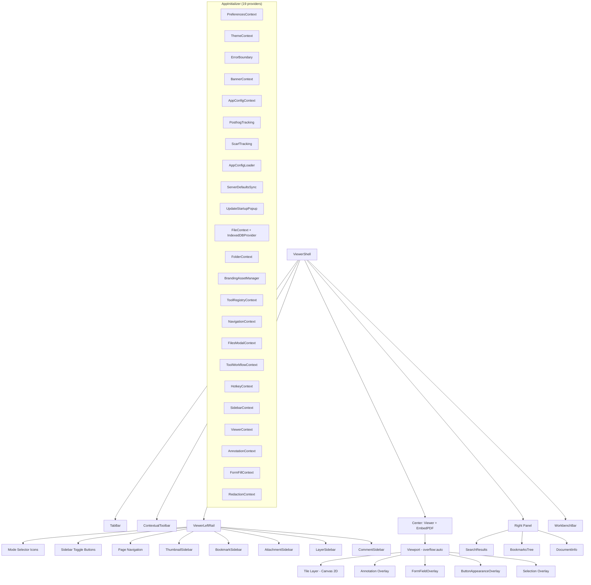
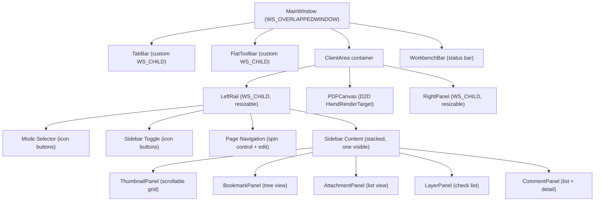
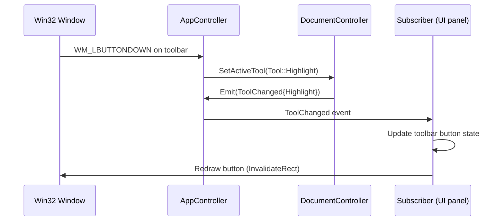

# UI Design: Current Analysis & Proposed Native Architecture

> **Document ID:** FILE-010 | **Status:** DRAFT | **Depends on:** ARCHITECTURE.md, FEATURE_SPEC.md

---

## Table of Contents

1. [Current UI Layout Analysis](#1-current-ui-layout-analysis)
2. [Current UI Hierarchy (Mermaid)](#2-current-ui-hierarchy)
3. [Proposed Native Win32 UI Architecture](#3-proposed-native-win32-ui-architecture)
4. [Window Layout Strategy](#4-window-layout-strategy)
5. [Color & Theme System](#5-color--theme-system)
6. [Typography](#6-typography)
7. [Dark Mode Implementation](#7-dark-mode-implementation)
8. [Professional Appearance Guidelines](#8-professional-appearance-guidelines)
9. [State Management in C++](#9-state-management-in-c)

---

## 1. Current UI Layout Analysis

### 1.1 Top-Level Shell

The entire application lives inside `ViewerShell` which orchestrates five major zones:

| Zone | Component | Source Path | Purpose |
|------|-----------|-------------|----------|
| Tab Bar | `TabBar` | `src/components/viewer/TabBar.tsx` | Multi-document tabs (SDI with tab strip) |
| Toolbar | `ContextualToolbar` | `src/components/viewer/ContextualToolbar.tsx` | Mode-dependent tool buttons |
| Left Rail | `ViewerLeftRail` | `src/components/viewer/ViewerLeftRail.tsx` | Sidebar mode selection + sidebar panels |
| Center | `Viewer` (EmbedPDF) | `src/components/viewer/Viewer.tsx` | PDF canvas with viewport/scroll/tiles |
| Right Panel | Various | `src/components/viewer/right-panel/` | Search results, bookmarks tree, document info |
| Bottom | `WorkbenchBar` | `src/components/viewer/WorkbenchBar.tsx` | Status bar with page info, zoom, tool state |

> **FACT:** The current layout is a single-window SDI (Single Document Interface) with a tab bar, not MDI. Each tab holds an independent EmbedPDF instance.

### 1.2 Left Rail Sub-Panels

`ViewerLeftRail` manages sidebar visibility. Each mode maps to a default sidebar:

| Sidebar | Component | File | Triggered By Mode |
|---------|-----------|------|-----------------|
| Thumbnails | `ThumbnailSidebar` | `src/components/viewer/ThumbnailSidebar.tsx` | View, Edit, Comment, Organize, Search |
| Bookmarks | `BookmarkSidebar` | `src/components/viewer/BookmarkSidebar.tsx` | View, Edit, Comment, Search |
| Attachments | `AttachmentSidebar` | `src/components/viewer/AttachmentSidebar.tsx` | View, Organize |
| Layers | `LayerSidebar` | `src/components/viewer/LayerSidebar.tsx` | View, Edit |
| Comments | `CommentSidebar` | `src/components/viewer/CommentSidebar.tsx` | Comment |

The left rail also contains mode-selection icons and a page navigation control (`PageNavigation`).

### 1.3 Contextual Toolbar Modes

`ContextualToolbar` renders different button sets per mode:

| Mode | Buttons Shown |
|------|--------------|
| **View** | Hand, Select, Zoom In, Zoom Out, Fit Width, Rotate, Print, Export |
| **Search** | Search input, Next, Prev, Match count, Highlight all |
| **Annotate** | Highlight, Underline, StrikeOut, Ink, StickyNote, Link, FreeText, Square, Circle, Line, Polygon, Polyline |
| **Edit** | Select, Text editing, Image editing, Page reorder |
| **Organize** | Page thumbnails drag-drop, rotate, delete, insert |

> **FACT:** Toolbar state is derived from the active mode (`NavigationContext`) and the `ToolRegistryContext` which provides the current active tool and file-chaining state.

### 1.4 Context Providers (19 total)

The React tree nests 19+ providers inside `AppInitializer`. Key UI-affecting ones:

- `PreferencesContext` — UI density, default zoom, theme selection
- `ThemeContext` — light/dark/system, mapped to CSS variables via `design-tokens.css`
- `NavigationContext` — active mode (View/Comment/Edit/Organize/Tools)
- `SidebarContext` — which sidebar is open, width
- `ToolWorkflowContext` — active tool, file chaining (consume/undo)
- `HotkeyContext` — keyboard shortcut registry
- `FileContext` — open documents, active document
- `ViewerContext` — EmbedPDF instance, viewport state
- `AnnotationContext` — annotation list, selection, editing state
- `FormFillContext` — form field interaction state
- `RedactionContext` — redaction pending tracker

> **RECOMMENDATION:** In C++, replace all 19 context providers with a single `AppController` that owns all subsystem controllers. Observers subscribe to specific events; there is no equivalent of React's re-render cascade.

---

## 2. Current UI Hierarchy



---

## 3. Proposed Native Win32 UI Architecture

### 3.1 Technology Choices

| Layer | Technology | Rationale |
|-------|-----------|----------|
| Window frame | Win32 `CreateWindowEx` with `WS_OVERLAPPEDWINDOW` | Native title bar, native resize, DWM composition |
| Common controls | ComCtl32 v6 (`commctrl.h`) | Modern look with visual styles enabled via manifest |
| Toolbar | Custom-drawn flat toolbar (no ribbon) | Lightweight, matches current minimal aesthetic |
| Sidebar panels | Custom `WS_CHILD` windows with scroll | Full control over layout and theming |
| Tab bar | Custom `WS_CHILD` with `TCN_SELCHANGE`-like behavior | Tab close buttons, drag-reorder, multi-doc |
| PDF canvas | Direct2D `ID2D1HwndRenderTarget` | Hardware-accelerated rendering of tiled bitmaps |
| Scroll | `WS_VSCROLL` | Custom scroll handling for virtual viewport |
| Status bar | `CreateStatusWindow` or custom | Page number, zoom, tool state |
| Menus | Win32 popup menus | Context menus, mode menus |
| Dialogs | `DialogBoxParam` / property sheets | File open, preferences, encrypted PDF unlock |
| Tooltips | `TOOLINFO` with `TTS_BALLOON` | Hover hints on toolbar buttons |

> **RECOMMENDATION:** Use a **custom flat toolbar** rather than the Windows Ribbon framework. The ribbon adds ~10MB to binary size and significant COM complexity for a PDF viewer that only needs 17 core tools. A flat toolbar with icon buttons, separators, and small dropdowns matches the current ContextualToolbar aesthetic perfectly.

### 3.2 Visual Style Manifest

Enable Common Controls v6 visual styles via an application manifest:

```xml
<!-- In app.manifest -->
<dependency>
  <dependentAssembly>
    <assemblyIdentity
      type="win32"
      name="Microsoft.Windows.Common-Controls"
      version="6.0.0.0"
      processorArchitecture="*"
      publicKeyToken="6595b64144ccf1df"
      language="*"/>
  </dependentAssembly>
</dependency>
```

> **FACT:** Without this manifest, Win32 controls render in the Windows 95 classic style. This is the single most important line for achieving a professional appearance.

### 3.3 Proposed Layout Structure



---

## 4. Window Layout Strategy

### 4.1 SDI with Tab Bar (Recommended)

> **RECOMMENDATION:** Use SDI with a tab bar, matching the current `TabBar` component behavior. Each tab corresponds to one open document. Only the active document's PDFium instance and tile cache are kept hot; others are swapped to a cold state (document loaded, tiles evicted).

**Rationale:**
- Matches existing UX — users already expect tabs
- Simpler than MDI — no child window management
- Better performance — only one D2D render target active
- Standard in modern apps (Chrome, VS Code, Edge)

### 4.2 Resizable Panels

The left rail and right panel should be resizable via drag handles:

```
+--+---+--------------------+---+--+
|M | L |                    | R |  |
|O | e |    PDF Canvas      | i |  |
|D | f |    (D2D)           | g |  |
|E | t |                    | h |  |
|  |   |                    | t |  |
+--+---+--------------------+---+--+
```

- **Mode icons column (M):** Fixed 48px width, icon-only buttons
- **Left sidebar (L):** Resizable, 180–400px default 240px, collapsible
- **PDF Canvas:** Fills remaining space
- **Right panel (R):** Resizable, 200–450px default 300px, collapsible
- Drag handle width: 4px, cursor changes on hover

### 4.3 Minimum Window Size

| Dimension | Value | Rationale |
|-----------|-------|----------|
| Min width | 800px | Left rail (48 + 180) + canvas (400) + right panel (172) |
| Min height | 600px | Tab bar (32) + toolbar (40) + canvas (480) + status (28) + padding |

---

## 5. Color & Theme System

### 5.1 Current Theme Implementation

The current app uses a three-layer theme system:

1. **CSS variables** in `design-tokens.css` — semantic tokens like `--color-bg-primary`, `--color-text-default`
2. **Mantine theme** — component-level overrides mapped to CSS variables
3. **PDF render mode** — `normal` / `dark` / `sepia` applied as CSS `filter` on the canvas

> **FACT:** The PDF render mode is separate from the UI theme. A user can have a dark UI with normal PDF rendering, or vice versa.

### 5.2 Proposed Win32 Token System

Map the CSS variable system to a C++ `ThemeTokens` struct:

```cpp
struct ThemeTokens {
    // Backgrounds
    Color bgPrimary;       // --color-bg-primary (main canvas area)
    Color bgSecondary;     // --color-bg-secondary (sidebar, toolbar)
    Color bgElevated;      // --color-bg-elevated (tooltips, popups)
    Color bgActive;        // --color-bg-active (selected item)

    // Text
    Color textPrimary;     // --color-text-default
    Color textSecondary;   // --color-text-secondary
    Color textDisabled;    // --color-text-disabled

    // Accents
    Color accentPrimary;   // --color-accent-primary (brand blue)
    Color accentHover;     // hover state
    Color accentActive;    // pressed/selected state

    // Borders
    Color borderSubtle;    // --color-border-subtle (1px separators)
    Color borderDefault;   // --color-border-default

    // PDF render overlay
    PdfRenderMode pdfMode; // Normal, Dark, Sepia
    float pdfBrightness;   // for dark/sepia filter equivalents
};
```

### 5.3 Color Values (Light Theme)

| Token | Light Value | Dark Value | Usage |
|-------|-------------|------------|-------|
| `bgPrimary` | `#FFFFFF` | `#1A1A1A` | PDF canvas background |
| `bgSecondary` | `#F5F5F5` | `#252525` | Sidebar, toolbar background |
| `bgElevated` | `#FFFFFF` | `#2D2D2D` | Popup menus, tooltips |
| `bgActive` | `#E8F0FE` | `#3D4F6F` | Selected tab, active tool |
| `textPrimary` | `#1F1F1F` | `#E0E0E0` | Body text |
| `textSecondary` | `#6B6B6B` | `#999999` | Secondary labels |
| `accentPrimary` | `#1A73E8` | `#8AB4F8` | Links, active elements |
| `borderSubtle` | `#E0E0E0` | `#3A3A3A` | Panel separators |
| `borderDefault` | `#DADCE0` | `#5F6368` | Input borders |

> **RECOMMENDATION:** Store themes as JSON or embedded resources. Load at startup and swap on `WM_THEME_CHANGE`. Do NOT hardcode colors — this enables future custom themes.

---

## 6. Typography

### 6.1 Font Selection

| Usage | Current (Web) | Proposed (Native) | Rationale |
|-------|--------------|-------------------|-----------|
| UI body | Inter (via Mantine) | **Segoe UI** 9pt | Native Windows UI font, already on all Windows 10/11 systems |
| UI heading | Inter Bold | **Segoe UI Semibold** 11pt | Consistent family, clear hierarchy |
| Monospace | JetBrains Mono | **Consolas** 9pt | Code/technical content in document info |
| Status bar | Mantine text-sm | **Segoe UI** 8pt | Compact but readable |

> **FACT:** Segoe UI is the standard Windows UI font since Windows Vista. Using it ensures the application looks native and consistent with the OS. No font embedding required.

### 6.2 Font Sizes (in DIP — Device Independent Pixels)

| Element | Size | Weight | Notes |
|---------|------|--------|-------|
| Tab label | 12 DIP | Regular | Truncated with ellipsis if too long |
| Toolbar button tooltip | 12 DIP | Regular | Standard tooltip font |
| Sidebar heading | 11 DIP | Semibold | Section titles in sidebars |
| Sidebar item | 12 DIP | Regular | Bookmark names, attachment names |
| Page number (left rail) | 12 DIP | Regular | Current/total display |
| Zoom percentage | 12 DIP | Regular | In toolbar or status bar |
| Search result | 12 DIP | Regular | With context snippet at 11 DIP |
| Status bar | 12 DIP | Regular | Page info, tool state |
| Annotation popup | 12 DIP | Regular | Comment text, form labels |

---

## 7. Dark Mode Implementation

### 7.1 Detection

```cpp
// In WndProc
case WM_SETTINGCHANGE:
    if (lpParam && wcscmp((LPCWSTR)lpParam, L"ImmersiveColorSet") == 0) {
        appController->OnSystemThemeChanged();
    }
    break;
```

Additionally, respect user override stored in preferences:

```cpp
enum class ThemePreference { System, Light, Dark };
```

### 7.2 Custom Draw for Controls

Win32 common controls with visual styles (v6 manifest) automatically respond to dark mode on Windows 10 1809+. For custom-drawn elements:

- **Toolbar buttons:** Custom draw using `ThemeTokens` colors. Use `DrawThemeBackground` with `VSCLASS_TOOLBAR` for hover/pressed states, but override fill colors.
- **Sidebar panels:** `WM_ERASEBKGND` fills with `bgSecondary`. Text drawn with `textPrimary`.
- **PDF canvas:** Background filled with `bgPrimary`. D2D bitmaps composited on top.
- **Separators:** 1px lines using `borderSubtle` color. No 3D bevels.
- **Tab bar:** Custom draw. Active tab: `bgPrimary` background with `accentPrimary` top border (2px). Inactive tabs: `bgSecondary`. Close button: hover reveals X icon.

### 7.3 PDF Render Mode (Separate from UI Theme)

> **FACT:** The current app applies CSS `filter: invert(1) hue-rotate(180deg)` for dark mode and `filter: sepia(0.8)` for sepia mode on the PDF canvas. This is a visual overlay, not a re-render.

In native:

```cpp
enum class PdfRenderMode { Normal, Dark, Sepia };

// When compositing tiles to D2D:
if (pdfMode == PdfRenderMode::Dark) {
    // Apply color matrix: invert + desaturate slightly
    D2D1::Matrix5x4F matrix = D2D1::Matrix5x4F::Translation(0, 0, 0);
    // Or use ID2D1Effect with CLSID_D2D1ColorMatrix
    colorMatrixEffect->SetValue(D2D1_COLORMATRIX_PROP_COLOR_MATRIX, &darkMatrix);
}
```

---

## 8. Professional Appearance Guidelines

### 8.1 Anti-Patterns to Avoid

| Pattern | Why It Looks Bad | Do This Instead |
|---------|-----------------|----------------|
| 3D beveled buttons | Windows 95 aesthetic | Flat buttons with subtle hover highlight |
| Thick sunken borders | Dated, heavy | 1px solid `borderSubtle` lines |
| System-default colors | Inconsistent across Windows versions | Use your own token colors |
| Different font per control | Chaotic, unprofessional | Segoe UI everywhere |
| Bitmap toolbar icons at wrong DPI | Blurry on high-DPI | SVG or multi-resolution ICO, render at current DPI |
| Gray default dialog backgrounds | Looks like an options dialog | Custom paint all backgrounds with theme tokens |
| Fixed non-resizable panels | Inflexible | Draggable splitters with min/max constraints |

### 8.2 Spacing & Layout Rules

| Rule | Value | Application |
|------|-------|-------------|
| Toolbar button size | 32×32 DIP (icon) with 4px padding | Consistent click targets |
| Toolbar height | 40 DIP | Compact but not cramped |
| Tab bar height | 36 DIP | Room for close button + icon |
| Sidebar section padding | 12px horizontal, 8px vertical | Breathing room |
| Sidebar item height | 28 DIP | Comfortable for click/touch |
| Separator thickness | 1px | Subtle, not heavy |
| Panel drag handle | 4px wide, full height | Visible on hover with cursor change |
| Status bar height | 24 DIP | Compact, single line |
| Minimum element spacing | 4px | Never butt elements together |

### 8.3 Smooth Scrolling

> **FACT:** The current app uses `overflow: auto` on the Viewport, which provides browser-native smooth scrolling. Win32's default `WS_VSCROLL` does NOT smooth scroll.

**Implementation:**

```cpp
// Use ScrollWindowEx with animation
void SmoothScroll(HWND hwnd, int delta, int durationMs = 150) {
    // Animate scroll offset over durationMs using a timer
    // Use ease-out curve: position = start + delta * (1 - (1-t)^3)
    // Trigger WM_PAINT on each frame
}
```

Alternatively, intercept `WM_MOUSEWHEEL` and use `ScrollWindowEx` with `SW_SMOOTHSCROLL` flag (Windows 11 22H2+), with fallback to manual animation on older versions.

### 8.4 High-DPI Support

```cpp
// In manifest or programmatic:
SetProcessDpiAwarenessContext(DPI_AWARENESS_CONTEXT_PER_MONITOR_AWARE_V2);

// All sizes in DIP. Convert to pixels for Win32 calls:
int DipsToPixels(int dips, double dpiScale) {
    return (int)(dips * dpiScale / 96.0 + 0.5);
}
```

Handle `WM_DPICHANGED` to resize and re-layout on monitor changes.

---

## 9. State Management in C++

### 9.1 Replacing React Context

The 19 React context providers create an implicit dependency graph. Any component can read from any context, causing uncontrolled re-renders. The C++ equivalent uses an **observer/event pattern**:

```cpp
class AppController {
public:
    // Subsystem controllers
    std::unique_ptr<DocumentController> documents;
    std::unique_ptr<ViewController> viewer;
    std::unique_ptr<AnnotationController> annotations;
    std::unique_ptr<ToolController> tools;
    std::unique_ptr<ThemeController> theme;
    std::unique_ptr<PreferencesController> prefs;
    std::unique_ptr<SearchController> search;

    // Event dispatch
    template<typename Event>
    void Emit(const Event& e);

    template<typename Event, typename Handler>
    EventToken Subscribe(Handler&& h);

    void Unsubscribe(EventToken token);
};
```

### 9.2 Observer Pattern Details

```cpp
// Type-safe event system
using EventToken = uint64_t;

template<typename T>
class Event {
    std::unordered_map<EventToken, std::function<void(const T&)>> handlers_;
    EventToken nextToken_ = 1;
public:
    EventToken Subscribe(std::function<void(const T&)> handler) {
        auto token = nextToken_++;
        handlers_[token] = std::move(handler);
        return token;
    }
    void Unsubscribe(EventToken token) { handlers_.erase(token); }
    void Emit(const T& e) { for (auto& [_, h] : handlers_) h(e); }
};
```

### 9.3 State Change Flow (vs. React)



Compare to React:

```
User Click → setState() → React re-render cascade → Virtual DOM diff → DOM update
```

The C++ approach is **surgical** — only the affected windows/regions are invalidated and repainted. No diffing, no virtual DOM, no wasted work.

### 9.4 ViewerBridgeRegistry Equivalent

> **FACT:** The current `ViewerBridgeRegistry` bypasses React's state management for high-frequency updates (scroll position, zoom level, cursor position) by directly mutating DOM elements. This is a performance optimization to avoid re-rendering the entire React tree on every scroll event.

In native C++, this pattern is unnecessary. `InvalidateRect` + `WM_PAINT` is already surgical. Direct manipulation of scroll position via `SetScrollInfo` and `ScrollWindowEx` has zero overhead compared to the React bridge workaround.

---

## Appendix A: Window Styles Reference

| Window | Style | Extended Style |
|--------|-------|----------------|
| Main window | `WS_OVERLAPPEDWINDOW` | `WS_EX_NOREDIRECTIONBITMAP` (for DWM) |
| Tab bar | `WS_CHILD \| WS_VISIBLE \| WS_CLIPCHILDREN` | — |
| Toolbar | `WS_CHILD \| WS_VISIBLE \| WS_CLIPCHILDREN` | — |
| Left rail | `WS_CHILD \| WS_CLIPCHILDREN \| WS_VSCROLL` | — |
| PDF canvas | `WS_CHILD \| WS_VISIBLE \| WS_VSCROLL \| WS_HSCROLL` | — |
| Right panel | `WS_CHILD \| WS_CLIPCHILDREN \| WS_VSCROLL` | — |
| Status bar | `WS_CHILD \| WS_VISIBLE` | — |
| Sidebar panels | `WS_CHILD \| WS_VSCROLL \| WS_VISIBLE` | — |
| Tooltip | `WS_POPUP \| TTS_ALWAYSTIP` | `WS_EX_TOPMOST \| WS_EX_TOOLWINDOW` |
| Context menu | Popup menu (not a window) | — |

---

*End of FILE-010: UI_DESIGN.md*